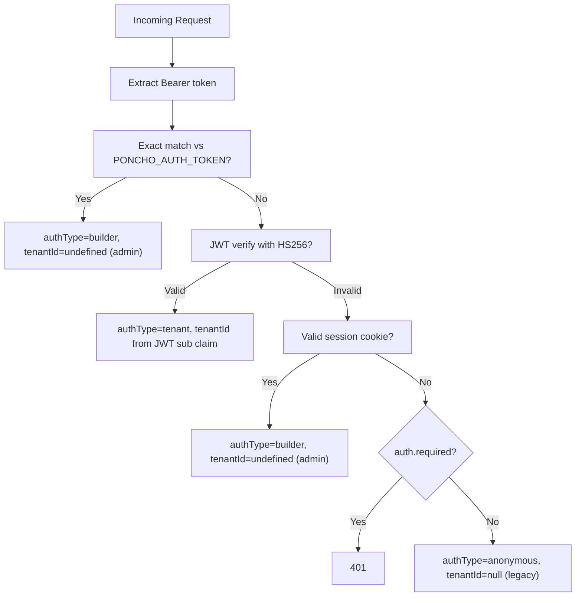

# Multi-Tenancy Implementation Plan

## Goal

Make poncho work as a shared agent harness: a builder deploys one agent and many tenants (end users, organizations, customers) use it, each with fully isolated data. Conversations, memory, reminders, todos, and uploads are all scoped per tenant. Existing single-user deployments continue to work unchanged — multi-tenancy is opt-in.

**What we're building:**

- A JWT-based auth model where builders create tenant-scoped tokens using any HS256 JWT library. Poncho verifies the token and scopes all data access to that tenant. No configuration needed — tenancy activates automatically when a valid JWT is received.
- Tenant isolation across every storage entity (conversations, memory, reminders, todos, uploads) at the KV key / file path level.
- Per-tenant secrets: builders declare tenant-self-serviceable env vars in `poncho.config.js` via a `tenantSecrets` config. Tenants can set their own values through the web UI or API. Builders can also set additional per-tenant secrets via CLI/API without declaring them in config. MCP `auth.tokenEnv` references resolve per-tenant automatically.
- A `createTenantToken` utility in `@poncho-ai/client` and a `poncho auth create-token` CLI command for convenience.
- CLI commands (`poncho secrets set/list/delete`), API endpoints, and a web UI settings panel for managing per-tenant secrets.
- Full backward compatibility: `tenantId: null` means legacy single-user mode, no migration needed. Builders adopt tenancy by simply creating and sending JWTs — no config changes, no redeployment.

**What we're not building (deferred):**

- Cron fan-out per tenant (builders can use `AgentClient` from their own backend for scheduled per-tenant work).
- Token revocation (mitigated by short TTLs).
- Tenant registry / enumeration API.
- Library mode (importing harness directly without the poncho HTTP server).
- Per-tenant custom headers for MCP servers that don't use bearer auth (edge case; can be addressed later if needed).

## Design Decisions

Based on the codebase audit and discussion:

- **Handler structure**: Thread `tenantId` through the existing monolithic handler via a `RequestContext` type. Do not refactor the handler into a router/middleware architecture — that is orthogonal work.
- **Tenant registry**: Deferred. Cron fan-out (which needs tenant enumeration) is out of scope for now. Builders who need per-tenant scheduled work can use `AgentClient` from their own backend.
- **Migration**: `tenantId: null` means "legacy single-user mode." No data migration needed. Multi-tenancy activates automatically when a valid JWT is received. When no JWTs are used, everything behaves exactly as today.
- **Memory seeding**: Not needed. Agent-wide instructions belong in `AGENT.md`. Per-tenant context can be sent in the first message. No `memory.template` config.
- **Token format**: JWT (HS256) signed with `PONCHO_AUTH_TOKEN`. Standard claims: `sub` = tenantId, `exp` = expiration (optional), `iat` = issued at, plus optional custom `meta` (metadata). Adds `jose` as a dependency to `@poncho-ai/harness` and `@poncho-ai/client`. Builders can create tokens using any JWT library in any language — our client utility is a convenience, not a requirement.
- **One tenant = one identity**: `tenantId` is the only scoping dimension. When `tenantId` is set, `ownerId` is always set to the `tenantId` value — there is no sub-user concept. Builders who need per-user isolation should create separate tenants. Existing single-user deployments continue using `ownerId: "local-owner"` with `tenantId: null` unchanged.
- **Three-way tenantId semantics**: `undefined` = builder/admin (no filter, sees everything), `null` = legacy single-user mode, `string` = tenant-scoped. Builder auth resolves to `undefined`. Anonymous/legacy resolves to `null`. Tenant JWT resolves to the `sub` claim string.
- **Token revocation**: Not supported in this iteration. Stateless JWTs cannot be individually revoked. Mitigation: use short TTLs (1h recommended). A deny-list (`poncho:v1:{agentId}:denied-tenants`) can be added in a future iteration if needed.
- **Per-tenant secrets**: Two categories. (1) `tenantSecrets` in `poncho.config.js` — declares env vars that tenants can self-manage via web UI or API. Simple `Record<string, string>` mapping env var name to a human-readable label. (2) Builder-only per-tenant secrets — no config declaration needed, builders set them directly via `poncho secrets set` CLI or API. Both categories are stored in the same KV backend (or local files), encrypted at rest with AES-GCM using a key derived from `PONCHO_AUTH_TOKEN`. At runtime, any code that resolves an env var name (like MCP `auth.tokenEnv`) checks the tenant's secrets first, then falls back to `process.env`. No changes to MCP config shape — the existing `tokenEnv` pattern already preserves the env var name for deferred resolution.
- **Reminders stay in a single store**: Reminders are NOT split into per-tenant stores. Instead, the existing single reminder store gains a `tenantId` field on each reminder, and queries filter by `tenantId`. This avoids the cron fan-out problem — the cron job iterates one store and delivers reminders to the correct tenant context.
- **PONCHO_AUTH_TOKEN is immutable**: The auth token is used as the JWT signing key and the secrets encryption key (via HKDF). Rotating it invalidates all existing tenant JWTs and makes all encrypted secrets unreadable. Builders should treat it as permanent. If rotation is needed, all tenants must get new tokens and re-enter their secrets. Document this clearly.

## Auth Model

Two levels of access, one token format for tenant scoping:

- **Builder auth**: `Authorization: Bearer <PONCHO_AUTH_TOKEN>` (raw API key). Full access, no tenant scope. For admin operations (viewing all tenants' data, configuration, etc.).
- **Tenant auth**: `Authorization: Bearer <JWT>`. Scoped to one tenant. Used by both builder backends (acting on behalf of a tenant) and end users (web UI). Builders create JWTs locally using any HS256 JWT library — no poncho API call needed.

**Token generation**: Builders create JWTs locally (signed with `PONCHO_AUTH_TOKEN` as the HS256 secret). A `createTenantToken` utility in `@poncho-ai/client` is provided as a convenience. Builders can also use any JWT library in any language. A `poncho auth create-token` CLI command is available for development/testing.



Existing single-secret auth becomes "builder auth" (full admin access). JWTs are the single mechanism for tenant scoping, used by both builder backends and end users.

## Web UI Tenant Experience

**Token delivery**: Query parameter `?token=xxx`. Builder generates a URL like `https://agent.example.com/?token=eyJ...` and gives it to the end user (or embeds it in an iframe).

**Client-side flow** (changes to `packages/cli/src/web-ui-client.ts`):

1. On load, check for `?token=` in the URL.
2. If present, strip it from the URL bar (`history.replaceState`) to avoid leaking in browser history.
3. Store the token in `sessionStorage` (survives page reloads within the tab, cleared when tab closes).
4. Send it as `Authorization: Bearer <token>` on all API calls instead of relying on cookies.
5. Skip the login screen — the token IS the auth. User lands on their tenant-scoped conversation list (empty on first visit, with a "New conversation" button).
6. On 401 response (token expired), show a "Session expired" message.

**No-token landing**: When someone hits the root URL without a token, they see the existing passphrase login form (builder access). This is unchanged from today.

**Builder vs tenant in the UI**: Builder auth (`authType=builder`) sees all conversations across all tenants (admin view). Tenant auth sees only their scoped conversations. The UI itself is the same — scoping is enforced server-side.

## KV Key Scheme

Current: `poncho:v1:{agentId}:conv:{convId}`

With tenancy (only when `tenantId` is non-null):

```
poncho:v1:{agentId}:t:{tenantId}:conv:{convId}
poncho:v1:{agentId}:t:{tenantId}:convmeta:{convId}
poncho:v1:{agentId}:t:{tenantId}:conversations
poncho:v1:{agentId}:t:{tenantId}:memory:main
poncho:v1:{agentId}:t:{tenantId}:todos:{convId}
poncho:v1:{agentId}:t:{tenantId}:secrets
```

When `tenantId` is null (legacy/single-user), keys remain unchanged.

Local file storage equivalent: `~/.poncho/store/{agent}/tenants/{tenantId}/conversations/`, `memory.json`, etc. Legacy files stay at current paths.

---

## Phase 1 — Types and Session Token API

**Goal**: Introduce tenant token issuance and `RequestContext` extraction. No behavior change for existing deployments.

### 1a. SDK types ([packages/sdk/src/index.ts](packages/sdk/src/index.ts))

- Add `tenantId?: string` to `RunInput` (alongside existing `conversationId`, `parameters`)
- Add `tenantId?: string` to `ToolContext` so tools can read the active tenant

### 1b. Harness config types ([packages/harness/src/config.ts](packages/harness/src/config.ts))

No changes to `PonchoConfig` for tenancy — there is no opt-in flag and no new config options. JWT verification runs automatically as a fallback when a Bearer token doesn't match the raw API key. Tenancy activates the moment a valid JWT is received.

### 1c. Tenant token verification ([packages/harness/src/tenant-token.ts](packages/harness/src/tenant-token.ts) — new file)

New module using `jose` for JWT verification:

- `verifyTenantToken(signingKey: string, token: string)` — verifies HS256 signature, checks `exp`, returns `{ tenantId: string, metadata?: Record<string, unknown> }` or undefined.
- Reads `sub` as `tenantId`, `meta` as metadata.
- Lives in harness (not cli) so the verification logic is reusable if the harness is used as a library.

Add `jose` as a dependency to `@poncho-ai/harness` (`pnpm --filter @poncho-ai/harness add jose`).

### 1d. RequestContext and auth extraction ([packages/cli/src/index.ts](packages/cli/src/index.ts))

Define near the top of `createRequestHandler`:

```typescript
type RequestContext = {
  authType: 'builder' | 'tenant' | 'anonymous';
  ownerId: string;
  tenantId: string | undefined | null;
  // undefined = builder/admin (no tenant filter, sees everything)
  // null = legacy single-user mode
  // string = tenant-scoped
  session?: SessionRecord;
};
```

Replace the current `ownerId` resolution block (around line 4562-4568) with a `resolveRequestContext()` helper that:

1. Checks for Builder Bearer token (existing exact-match logic). If valid: `authType: 'builder'`, `tenantId: undefined` (admin, no filter), `ownerId: "local-owner"`.
2. If not builder, try JWT verification (HS256 with `PONCHO_AUTH_TOKEN`). If valid: `authType: 'tenant'`, `tenantId` from `sub` claim, `ownerId` set to `tenantId`.
3. If not JWT, check for session cookie (existing passphrase login). If valid: `authType: 'builder'`, `tenantId: undefined`, `ownerId: "local-owner"` (same as bearer builder auth).
4. Fall back to anonymous with `ownerId: "local-owner"`, `tenantId: null` (legacy mode).

All existing route code references `ctx.ownerId` and `ctx.tenantId` instead of bare `ownerId`.

### 1e. Update SessionStore ([packages/cli/src/web-ui-store.ts](packages/cli/src/web-ui-store.ts))

Session cookies are for builder/passphrase auth only. Tenant auth uses `sessionStorage` (Phase 1h), not cookies. No `tenantId` field is needed on `SessionRecord`.

However, `resolveRequestContext()` still needs to handle the cookie path: if a valid session cookie is present, resolve as `authType: 'builder'` with `tenantId: undefined` (same as bearer token builder auth). This preserves existing web UI passphrase login behavior.

### 1f. Client token utility ([packages/client/src/index.ts](packages/client/src/index.ts))

Export a `createTenantToken` convenience function using `jose`:

```typescript
import { createTenantToken } from "@poncho-ai/client";

const token = await createTenantToken({
  signingKey: process.env.PONCHO_AUTH_TOKEN,
  tenantId: "acme-corp",
  expiresIn: "1h",            // optional, string or seconds
  metadata: { plan: "pro" },  // optional
});
```

This is a convenience — builders can also use any JWT library in any language to create HS256 tokens with `sub` = tenantId. No lock-in to our SDK.

Add `jose` as a dependency to `@poncho-ai/client` (`pnpm --filter @poncho-ai/client add jose`).

Update `AgentClientOptions` to accept a `token` field (JWT) as an alternative to `apiKey`:

```typescript
// Admin access (no tenant scope)
const admin = new AgentClient({
  url: "https://my-agent.fly.dev",
  apiKey: process.env.PONCHO_AUTH_TOKEN,
});

// Tenant-scoped access
const scoped = new AgentClient({
  url: "https://my-agent.fly.dev",
  token, // JWT — sent as Authorization: Bearer <jwt>
});
```

`apiKey` and `token` are mutually exclusive. Both are sent as `Authorization: Bearer`, but `apiKey` grants builder access while `token` (JWT) grants tenant-scoped access.

### 1g. CLI token command ([packages/cli/src/index.ts](packages/cli/src/index.ts))

New `poncho auth create-token` subcommand for development/testing:

```bash
poncho auth create-token --tenant acme-corp --ttl 24h
# Output: eyJ0eXBlIjoidGVuYW50I...
```

Reads `PONCHO_AUTH_TOKEN` from `.env` or environment, signs a token, prints it. Builder copies it into `?token=xxx` URL for local testing.

### 1h. Web UI client token handling ([packages/cli/src/web-ui-client.ts](packages/cli/src/web-ui-client.ts))

Update the embedded web UI client JavaScript:

- On page load, extract `?token=` from the URL. If found, `history.replaceState` to strip it, store in `sessionStorage`.
- When a `sessionStorage` token exists, add `Authorization: Bearer <token>` to all `fetch` calls instead of relying on cookie auth.
- Skip the `GET /api/auth/session` check and login flow when a token is present — go directly to conversation list.
- Handle 401 responses with a "Session expired, please reload" message rather than redirecting to login.

### 1i. OpenAPI updates

- [packages/cli/src/api-docs.ts](packages/cli/src/api-docs.ts): Document JWT tenant auth scheme alongside existing `bearerAuth`. Add JWT claims reference (`sub`, `meta`).

### 1j. Build validation

```bash
pnpm --filter @poncho-ai/sdk build && pnpm --filter @poncho-ai/harness build && pnpm --filter @poncho-ai/client build && pnpm --filter @poncho-ai/cli build
pnpm test
```

---

## Phase 2 — Conversation Scoping

**Goal**: Conversations are fully isolated by tenant. Legacy `null` tenants continue to work.

### 2a. ConversationStore interface ([packages/harness/src/state.ts](packages/harness/src/state.ts))

Extend `create` and list methods:

```typescript
export interface ConversationStore {
  // tenantId semantics for list/query: undefined = no filter, null = legacy only, string = scoped
  list(ownerId?: string, tenantId?: string | null): Promise<Conversation[]>;
  listSummaries(ownerId?: string, tenantId?: string | null): Promise<ConversationSummary[]>;
  get(conversationId: string): Promise<Conversation | undefined>;
  // tenantId for create defaults to null (legacy). Callers pass ctx.tenantId ?? null.
  create(ownerId?: string, title?: string, tenantId?: string | null): Promise<Conversation>;
  // ... rest unchanged
}
```

### 2b. InMemoryConversationStore ([packages/harness/src/state.ts](packages/harness/src/state.ts) ~line 258)

- `create()`: Accept and store `tenantId` (currently hardcoded to `null` at line 315).
- `list()`/`listSummaries()`: Add `tenantId` filter alongside existing `ownerId` filter.

### 2c. FileConversationStore ([packages/harness/src/state.ts](packages/harness/src/state.ts) ~line 401)

- Add `tenantId` to `ConversationStoreFile.conversations[]` entries and to `create()`.
- List methods filter by `tenantId` when provided.
- When `tenantId` is non-null, conversation files go under `tenants/{tenantId}/conversations/` subdirectory; when null, current paths are used.

### 2d. KeyValueConversationStoreBase ([packages/harness/src/state.ts](packages/harness/src/state.ts) ~line 783)

Update `namespace()` (line 824) to accept optional `tenantId`:

```typescript
private async namespace(tenantId?: string | null): Promise<string> {
  const agentId = await this.agentIdPromise;
  const base = `poncho:${STORAGE_SCHEMA_VERSION}:${slugifyStorageComponent(agentId)}`;
  return tenantId ? `${base}:t:${slugifyStorageComponent(tenantId)}` : base;
}
```

Update all key methods (`conversationKey`, `conversationMetaKey`, `ownerIndexKey`) to thread `tenantId`. The `create()` method on each subclass (`UpstashConversationStore`, `RedisLikeConversationStore`, `DynamoDbConversationStore`) sets `tenantId` from parameter.

### 2e. ConversationState keys ([packages/harness/src/state.ts](packages/harness/src/state.ts))

The `UpstashStateStore` and `RedisLikeStateStore` currently use raw `runId` as key. Change to: `poncho:v1:{agentId}:state:{runId}` (or `poncho:v1:{agentId}:t:{tenantId}:state:{runId}` when tenant-scoped). This fixes the pre-existing bug where state keys could theoretically collide across agents.

### 2f. Subagent tenantId propagation ([packages/cli/src/index.ts](packages/cli/src/index.ts))

When a subagent is spawned (`/api/internal/subagent/:id/run`), the new conversation must inherit `tenantId` from the parent conversation. Update the internal subagent endpoint and `SubagentManager` to propagate `tenantId` when creating child conversations.

### 2g. API handler updates ([packages/cli/src/index.ts](packages/cli/src/index.ts))

Thread `ctx.tenantId` through all conversation endpoints:

- `POST /api/conversations` (line ~5670): `conversationStore.create(ctx.ownerId, title, ctx.tenantId ?? null)` (defaults to `null` for creates, not `undefined`)
- `GET /api/conversations` (line ~5630): `conversationStore.listSummaries(ctx.ownerId, ctx.tenantId)`. Builder auth (`tenantId: undefined`) returns all conversations; support optional `?tenant=acme` query param for builder-mode filtering.
- `GET /api/conversations/:id`: After fetching, verify tenant access. Skip check when `ctx.tenantId` is `undefined` (builder auth sees everything). When `ctx.tenantId` is a string or `null`, verify `conversation.tenantId === ctx.tenantId`. Return 404 on mismatch.
- Same tenant check on PATCH, DELETE, POST messages, events SSE, stop, compact, continue, subagents, todos.
- `GET /api/uploads/:key`: When tenancy enabled, namespace upload keys by tenant (Phase 3).

### 2h. ConversationSummary type ([packages/harness/src/state.ts](packages/harness/src/state.ts) line 365)

Add `tenantId?: string | null` to `ConversationSummary` (it's currently missing from the summary type even though the full `Conversation` has it).

### 2i. Web UI conversation store ([packages/cli/src/web-ui-store.ts](packages/cli/src/web-ui-store.ts))

Update `WebUiConversationStore.create()` to accept and persist `tenantId`. Update list methods to filter by tenant.

---

## Phase 3 — Memory, Reminders, Todos, Uploads

**Goal**: All remaining entities gain tenant isolation.

### 3a. MemoryStore ([packages/harness/src/memory.ts](packages/harness/src/memory.ts))

- `createMemoryStore()` (line 225) gains optional `tenantId` parameter.
- KV key becomes: `poncho:v1:{agentId}:t:{tenantId}:memory:main` when tenant-scoped.
- Local file becomes: `tenants/{tenantId}/memory.json` when tenant-scoped.
- New tenants start with empty memory (same as today's default). Builders can seed context via the first message or the system prompt.

### 3b. Harness memory initialization ([packages/harness/src/harness.ts](packages/harness/src/harness.ts) ~line 1357)

Currently one `MemoryStore` is created at `initialize()` time. For tenancy, memory stores need to be per-tenant. Two approaches:

- **Recommended**: Lazy-create and cache `MemoryStore` instances per `tenantId` in a `Map<string, MemoryStore>`. Expose `getMemoryStore(tenantId)` on the harness. The `run()` method (line 1660) calls `getMemoryStore(input.tenantId)` instead of `this.memoryStore`.
- The cache is bounded (LRU or max-size with eviction) to prevent unbounded growth.

### 3c. ReminderStore ([packages/harness/src/reminder-store.ts](packages/harness/src/reminder-store.ts))

Reminders stay in a single store (not per-tenant) to avoid the cron fan-out problem. The cron job iterates one store and delivers each reminder in the correct tenant context.

- Add `tenantId: string | null` to the `Reminder` interface (line 18).
- `set_reminder` tool ([packages/harness/src/reminder-tools.ts](packages/harness/src/reminder-tools.ts) line 81): populate `tenantId` from `context.tenantId`.
- `list_reminders`: filter by `tenantId` when present (tenant auth sees only their reminders, builder auth sees all).
- `cancel_reminder`: validate `tenantId` ownership before cancelling.
- Cron reminder check: when firing a reminder, set `tenantId` on the `RunInput` so the resulting conversation run is tenant-scoped.

### 3d. TodoStore ([packages/harness/src/todo-tools.ts](packages/harness/src/todo-tools.ts))

- `createTodoStore()` gains optional `tenantId`.
- KV key: `poncho:v1:{agentId}:t:{tenantId}:todos:{convId}` when tenant-scoped.
- API route `GET /api/conversations/:id/todos`: validate tenant ownership of the conversation before returning todos.

### 3e. Upload validation ([packages/harness/src/upload-store.ts](packages/harness/src/upload-store.ts))

When tenancy is enabled:

- Upload keys are prefixed with tenant: `{tenantId}/{sha256-hash}.{ext}`.
- `GET /api/uploads/:key` validates the tenant prefix matches `ctx.tenantId`.

### 3f. Conversation recall ([packages/cli/src/index.ts](packages/cli/src/index.ts) ~line 5707)

The lazy recall corpus builder currently filters by `ownerId`. Add `tenantId` filter: only return conversations where `tenantId === ctx.tenantId`.

### 3g. Telemetry tenant attribution ([packages/harness/src/telemetry.ts](packages/harness/src/telemetry.ts))

Add `tenantId` as a span attribute on OTLP telemetry events when present. Small change — include `tenant.id` in the span attributes alongside existing `agent.id` and `run.id`. Enables builders to filter traces/metrics by tenant in their observability stack.

### 3h. Tool context threading

In the harness `run()` method (line ~2588), ensure `ToolContext` includes `tenantId`:

```typescript
const toolContext: ToolContext = {
  runId,
  agentId: agent.frontmatter.id ?? agent.frontmatter.name,
  step,
  workingDir: this.workingDir,
  parameters: input.parameters ?? {},
  abortSignal: input.abortSignal,
  conversationId: input.conversationId,
  tenantId: input.tenantId, // NEW
};
```

---

## Phase 4 — Per-Tenant Secrets

**Goal**: Builders can declare env vars as per-tenant overridable. Tenants get their own values for MCP auth and custom scripts. Managed via CLI, API, and web UI.

### 4a. Secrets config type ([packages/harness/src/config.ts](packages/harness/src/config.ts))

Add `tenantSecrets` to `PonchoConfig`:

```typescript
tenantSecrets?: Record<string, string>;
// key = env var name, value = human-readable label for the web UI
// Example: { LINEAR_API_KEY: "Linear API Key", STRIPE_KEY: "Stripe Secret Key" }
```

Anything listed here is tenant-self-serviceable — tenants can set/update/clear their own values through the web UI or API. The label is shown in the settings panel. When `tenantSecrets` is not configured, the settings UI is hidden.

Builder-only per-tenant secrets (not listed in config) can still be set via `poncho secrets set` CLI or the API. They follow the same storage and resolution logic but aren't exposed in the tenant-facing UI.

### 4b. SecretsStore ([packages/harness/src/secrets-store.ts](packages/harness/src/secrets-store.ts) — new file)

New module for storing and retrieving per-tenant secret overrides:

```typescript
interface SecretsStore {
  get(tenantId: string): Promise<Record<string, string>>;
  set(tenantId: string, key: string, value: string): Promise<void>;
  delete(tenantId: string, key: string): Promise<void>;
  list(tenantId: string): Promise<string[]>; // returns env var names that have overrides
}
```

Implementations:

- **File-based**: Stores at `~/.poncho/store/{agent}/tenants/{tenantId}/secrets.json`.
- **KV-based**: Key `poncho:v1:{agentId}:t:{tenantId}:secrets`.

**Encryption at rest**: All secret values are encrypted with AES-256-GCM before storage. The encryption key is derived from `PONCHO_AUTH_TOKEN` using HKDF (with a fixed salt like `"poncho-secrets-v1"`). The stored value is `{ iv, ciphertext, tag }` (base64-encoded). Decryption happens on read. This uses Node.js built-in `crypto` module — no new dependencies.

A `resolveEnv(tenantId: string | null, envName: string)` helper reads the tenant's secret override (decrypted) first, falls back to `process.env[envName]`:

```typescript
async function resolveEnv(
  secretsStore: SecretsStore | undefined,
  tenantId: string | null,
  envName: string,
): Promise<string | undefined> {
  if (tenantId && secretsStore) {
    const secrets = await secretsStore.get(tenantId);
    if (secrets[envName]) return secrets[envName];
  }
  return process.env[envName];
}
```

### 4c. MCP bridge per-tenant resolution ([packages/harness/src/mcp.ts](packages/harness/src/mcp.ts))

The current `startLocalServers()` resolves `process.env[tokenEnv]` once at startup and bakes the token into the `StreamableHttpMcpRpcClient`. For multi-tenancy, this needs to become per-request.

Changes:

- `LocalMcpBridge` gains a `setSecretsStore(store: SecretsStore)` method (or accepts it in constructor).
- `StreamableHttpMcpRpcClient` changes: instead of a static `bearerToken` in the constructor, it accepts a `tokenResolver: () => Promise<string | undefined>` function.
- `buildHeaders()` calls `await tokenResolver()` to get the token per-request.
- `loadTools()` / `callTool()` are updated to pass the current tenant context so the resolver can look up the right secret.
- When no tenant is active (legacy mode), the resolver returns `process.env[tokenEnv]` as before — no behavior change.

Alternatively (simpler): keep the static client for tool discovery, but create short-lived per-tenant clients for `callTool` when `tenantId` is present. Trade-off: more client instances, but simpler code and no shared mutable state.

### 4d. CLI commands ([packages/cli/src/index.ts](packages/cli/src/index.ts))

New `poncho secrets` subcommands:

```bash
# Set a secret for a tenant
poncho secrets set --tenant acme-corp LINEAR_API_KEY lk_acme_123

# List secrets for a tenant (shows env var names, not values)
poncho secrets list --tenant acme-corp
# Output: LINEAR_API_KEY (set)

# Delete a tenant's secret override (falls back to process.env)
poncho secrets delete --tenant acme-corp LINEAR_API_KEY
```

Builder auth via CLI can set any env var name as a per-tenant secret (not limited to `tenantSecrets` entries). This allows builders to provision secrets that tenants can't see or edit.

### 4e. API endpoints ([packages/cli/src/index.ts](packages/cli/src/index.ts))

REST API for managing secrets:

- `GET /api/secrets` — Tenant auth: returns `tenantSecrets` entries (label + whether the tenant has an override set). Builder auth: returns all secrets for a given tenant (`?tenant=` required), including both `tenantSecrets` and builder-only ones.
- `PUT /api/secrets/:envName` — body `{ "value": "..." }`. Tenant auth: can only set keys listed in `tenantSecrets`, returns 403 otherwise. Builder auth: can set any key (`?tenant=` required).
- `DELETE /api/secrets/:envName` — removes override. Same auth pattern as PUT.

### 4f. Web UI tenant settings panel ([packages/cli/src/web-ui-client.ts](packages/cli/src/web-ui-client.ts))

When a tenant is logged in (JWT auth) and the agent has `tenantSecrets` configured:

- Add a "Settings" tab/button to the web UI (only visible when `tenantSecrets` has entries).
- Renders a form with one field per `tenantSecrets` entry (label from config, env var name shown as hint).
- Shows whether a value is set (masked) or using the default.
- Tenant can set/update/clear their own values.
- Calls `PUT /api/secrets/:envName` and `DELETE /api/secrets/:envName`.

This is only visible to tenant-auth users. Builder-auth users manage secrets through the CLI or API.

---

## Phase 5 — Documentation and Polish

### 5a. README updates ([README.md](README.md))

- New "Multi-Tenancy" section explaining JWT-based tenant scoping, token creation, and per-tenant secrets.
- Update auth section to document the two auth tiers (builder vs tenant).
- Document the `tenantSecrets` config and how MCP `tokenEnv` resolves per-tenant.

### 5b. Init template ([packages/cli/src/index.ts](packages/cli/src/index.ts))

Update `README_TEMPLATE` (scaffolded project README) with tenancy and secrets guidance.

### 5c. OpenAPI spec ([packages/cli/src/api-docs.ts](packages/cli/src/api-docs.ts))

- Ensure JWT tenant auth scheme is fully documented alongside existing `bearerAuth`.
- Document secrets API endpoints (`GET/PUT/DELETE /api/secrets`).
- Add `tenantId` to relevant response schemas where applicable.

---

## Backward Compatibility

Every phase preserves full backward compatibility:

- There is no opt-in flag. Tenancy activates automatically when a valid JWT is received. When no JWT is present, all code paths are identical to today.
- Three-way `tenantId` semantics: `undefined` = builder/admin (no filter), `null` = legacy single-user mode, `string` = tenant-scoped. Existing data has `tenantId: null` and continues to work.
- `ConversationStore.create(ownerId, title)` still works (third arg defaults to `null`).
- Builder Bearer tokens work exactly as before.
- Web UI without tenant tokens works exactly as before.
- MCP `auth.tokenEnv` continues to resolve from `process.env` when no tenant is active or no secrets are configured. Existing single-tenant deployments are unchanged.

## Risk Mitigation

- Each phase has its own changeset and can be shipped independently.
- Phase 1 (auth) ships with no storage changes, so existing data is untouched.
- Phase 2 (conversations) is the largest change. The key insight is that `tenantId: null` uses the existing key paths, so no migration is needed.
- Phase 3 (memory/reminders) follows the same pattern established in Phase 2.
- Phase 4 (secrets) is additive — tenant self-service only activates when `tenantSecrets` is configured. MCP per-tenant resolution only activates when a `SecretsStore` has overrides. Existing behavior is unchanged.
- `PONCHO_AUTH_TOKEN` rotation is a destructive operation — document clearly that it invalidates all JWTs and encrypted secrets.

## Files Changed Per Phase

**Phase 1** (7 files + 1 new + 2 dependency additions):

- `packages/sdk/src/index.ts` — types
- `packages/harness/src/tenant-token.ts` — new file: JWT verification using `jose`
- `packages/cli/src/index.ts` — `RequestContext`, auth extraction, cookie path handling, CLI `auth create-token` command
- `packages/cli/src/web-ui-client.ts` — client-side `?token=` extraction and sessionStorage handling
- `packages/cli/src/api-docs.ts` — OpenAPI updates
- `packages/client/src/index.ts` — `createTenantToken` utility, `token` option on `AgentClient`
- Add `jose` to `@poncho-ai/harness` and `@poncho-ai/client`

**Phase 2** (4 files):

- `packages/harness/src/state.ts` — all store implementations + interface
- `packages/harness/src/subagent-manager.ts` — tenantId propagation to child conversations
- `packages/cli/src/index.ts` — API handler threading, subagent endpoint
- `packages/cli/src/web-ui-store.ts` — web UI store

**Phase 3** (7 files):

- `packages/harness/src/memory.ts` — tenant-scoped memory
- `packages/harness/src/harness.ts` — lazy memory store cache, tool context
- `packages/harness/src/reminder-store.ts` — tenant-scoped reminders
- `packages/harness/src/reminder-tools.ts` — tenant in tool context
- `packages/harness/src/todo-tools.ts` — tenant-scoped todos
- `packages/harness/src/telemetry.ts` — tenant attribution on spans
- `packages/cli/src/index.ts` — recall filter, upload validation, reminder tools

**Phase 4** (5 files + 1 new):

- `packages/harness/src/config.ts` — `tenantSecrets` config type
- `packages/harness/src/secrets-store.ts` — new file: SecretsStore interface + file/KV implementations + `resolveEnv` helper
- `packages/harness/src/mcp.ts` — per-tenant token resolution in MCP bridge
- `packages/cli/src/index.ts` — `poncho secrets` CLI commands + `/api/secrets` API endpoints
- `packages/cli/src/web-ui-client.ts` — tenant settings panel UI

**Phase 5** (3 files):

- `README.md`
- `packages/cli/src/index.ts` — README template
- `packages/cli/src/api-docs.ts`

## Deferred (Future Iteration)

- **Cron fan-out**: `TenantStore` for enumeration, `CronJobConfig.fanOut` option, per-tenant cron/reminder iteration. Builders can work around this by using `AgentClient` from their own backend to schedule per-tenant work.
- **Token revocation**: Stateless tokens can't be individually revoked. Short TTLs are the current mitigation. A lightweight deny-list (`poncho:v1:{agentId}:denied-tenants` KV key, checked per request) could be added later if needed, with a `poncho tenant deny <id>` CLI command.
- **Per-tenant MCP server configs**: Different MCP server URLs/connections per tenant (e.g., tenant A uses one Linear workspace, tenant B uses another). Phase 4 covers per-tenant bearer tokens (same server, different credentials), but entirely different server endpoints per tenant is out of scope. Builders can work around this using an MCP proxy.
- **Per-tenant custom headers**: MCP servers that use non-bearer auth (e.g., custom `X-API-Key` headers) don't benefit from the `tokenEnv` resolution. The `headers` field is static. A `$VAR` interpolation syntax or header-level `Env` references can be added later if needed.
- **Messaging tenant mapping**: Slack/Telegram/email adapters bypass poncho auth. A mapping from platform channel/user to tenant is needed for multi-tenant messaging. Separate feature.
- **Per-tenant rate limiting**: Prevent one tenant from monopolizing the agent. Separate feature.
- **Library mode**: Allow builders to import `AgentHarness` directly into their own Node.js app without the poncho HTTP server. Tenant scoping at the store level would work unchanged; the builder manages their own HTTP layer.
