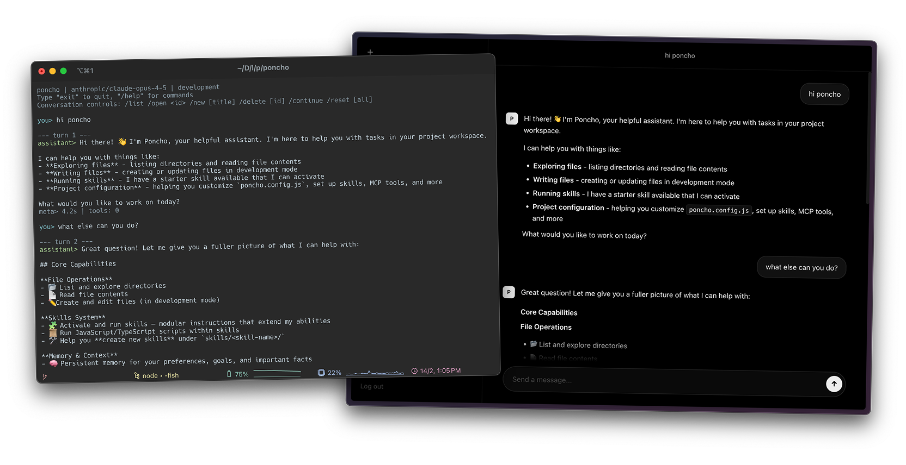

# Poncho

Poncho is a general agent harness built for the web.

Develop locally with `poncho dev`, then deploy the same agent to production with your skills and scripts, tools and MCP servers, OpenTelemetry traces, and testing workflows.

Deployed agents are accessible via web UI, REST API, or the TypeScript SDK.

> **Beta**: Poncho is under active development. Expect breaking changes, and please open an issue if you hit anything confusing or sharp.



```bash
npm install -g @poncho-ai/cli

poncho init my-agent
cd my-agent
poncho dev
```

## What is Poncho?

Poncho is a framework for building custom AI agents that are version-controlled in git, developed locally, and deployed in isolated cloud environments. You define behavior in `AGENT.md`, iterate by chatting with the agent on your machine, and expose the same agent safely through a UI/API in production. In production, agents can only act through the skills and tools you configure.

Poncho shares conventions with Claude Code and OpenClaw (`AGENT.md` + `skills/` folder) and implements the [Agent Skills open standard](https://agentskills.io/home). Skills are portable across 25+ platforms including GitHub Copilot, Cursor, and VS Code.

### Getting Started
- [Why Poncho?](#why-poncho)
- [Quick Start](#quick-start)

### Core Concepts
- [The AGENT.md File](#the-agentmd-file)
- [Adding Skills](#adding-skills)
- [Using MCP Servers](#using-mcp-servers)

### Development
- [Local Development](#local-development)
- [Testing Your Agent](#testing-your-agent)

### Deploy & Integrate
- [Building and Deploying](#building-and-deploying)
- [HTTP API](#http-api)
- [Multi-turn Conversations](#multi-turn-conversations)

### Features
- [Persistent Memory](#persistent-memory-mvp)
- [Observability](#observability)

### Reference
- [Configuration](#configuration-reference)
- [Security](#security)
- [Examples](#examples)
- [Error Handling](#error-handling)
- [Troubleshooting](#troubleshooting)

## Why Poncho?

1. ### Local-first development
   Chat with your agent via `poncho dev` (web UI + API) or `poncho run --interactive` (terminal UI), with tool calls streaming as they run.

2. ### Same agent in dev and prod
   What you build locally (`AGENT.md`, `skills/`, config, tests) is what you deploy, with your guardrails.

3. ### Guardrails by configuration
   In production, agents only act through the tools/skills you enable (and risky tools can require approval).

4. ### Deployable + observable
   Build once and run on Vercel, Docker, Lambda, Fly.io, and more, with OpenTelemetry traces and `poncho test` workflows.

**Key features:**

- **Git-native**: agent behavior, skills, and tests live in your repository (reviewable diffs + easy rollbacks).
- **Single-file agent definition**: define runtime config + instructions in `AGENT.md` (YAML frontmatter + prompt content).
- **Skills you can ship**: AgentSkills-style `skills/*/SKILL.md` plus TypeScript/JavaScript scripts under `scripts/`.
- **MCP support**: connect remote tool servers and inject required environment variables through config.
- **Conversation-first API + streaming**: stored conversations with SSE streaming responses and tool events.
- **Pluggable storage + memory**: local files for dev or hosted stores (e.g. Upstash), with optional persistent memory + recall.
- **Testing + observability**: `poncho test` workflows and OpenTelemetry traces/events.

## Quick Start

### 1. Create an agent

```bash
poncho init my-agent
cd my-agent
```

Init options:
- `poncho init <name>`: light onboarding (recommended defaults)
- `poncho init <name> --yes`: skip onboarding and configure manually

This creates a ready-to-run project:

```
my-agent/
├── AGENT.md           # Your agent definition
├── package.json       # Dependencies (skills)
├── poncho.config.js   # Configuration (optional)
├── .env.example       # Environment variables template
├── tests/
│   └── basic.yaml     # Starter test suite
├── skills/
│   └── starter/
│       ├── SKILL.md
│       └── scripts/
│           └── starter-echo.ts
└── .gitignore
```

**package.json** includes the runtime:

```json
{
  "name": "my-agent",
  "private": true,
  "type": "module",
  "dependencies": {
    "@poncho-ai/harness": "^0.1.0"
  }
}
```

- `@poncho-ai/harness` is the agent runtime - it handles the conversation loop, tool execution, and streaming.
- A local starter skill scaffold is generated under `skills/starter/`.

### 2. Configure your API key (if you skipped onboarding)

```bash
cp .env.example .env
# Edit .env and add your Anthropic API key
```

```bash
# .env
ANTHROPIC_API_KEY=sk-ant-...
```

### 3. Run locally

```bash
poncho dev
```

Opens a local server at `http://localhost:3000`. Try it:

```bash
curl -X POST http://localhost:3000/api/conversations \
  -H "Content-Type: application/json" \
  -d '{"title": "Quick start"}'
```

On the first interactive session (`poncho dev` chat UI or `poncho run --interactive`), the agent introduces available features and explains that you can configure settings by describing the outcome you want.

### 4. Deploy

```bash
# Build for Vercel
poncho build vercel
cd .poncho-build/vercel
vercel deploy --prod

# Or build for Docker
poncho build docker
docker build -t my-agent .
```

## The AGENT.md File

Your agent is defined in a single `AGENT.md` file with YAML frontmatter plus prompt content.

This file defines your agent's instructions, context, and runtime configuration for each session.

- **Frontmatter** sets runtime configuration (name, model, limits, and related metadata)
- **Body content** defines behavior and instructions the model follows
- **Mustache variables** let you inject runtime context dynamically (for example, environment or working directory)
- **Capabilities guidance** documents which tools/skills are available so behavior stays explicit and predictable

`poncho init` scaffolds this file so you can start quickly, then you can edit it as your agent's behavior and runtime settings evolve.

### Frontmatter options

```yaml
---
# Required
name: my-agent

# Optional
description: What this agent does

model:
  provider: anthropic          # anthropic, openai
  name: claude-opus-4-5        # Model to use
  temperature: 0.7             # 0.0 - 1.0
  maxTokens: 4096              # Max tokens in model response

limits:
  maxSteps: 50                 # Max turns before stopping
  timeout: 300                 # Max runtime in seconds (5 min)

# Optional tool intent (declarative; policy is still enforced in config)
allowed-tools:
  - mcp:github/list_issues    # MCP: mcp:server/tool or mcp:server/*
  - triage/scripts/*           # Scripts: skill/scripts/file.ts or skill/scripts/*
---
```

### Dynamic content with Mustache

You can use Mustache templating for dynamic content:

```markdown
---
name: project-assistant
---

# Project Assistant

Working on: {{parameters.projectName}}
Environment: {{runtime.environment}}

{{#parameters.customInstructions}}
## Custom Instructions
{{parameters.customInstructions}}
{{/parameters.customInstructions}}
```

Pass parameters when calling the agent:

```bash
# Create a conversation
CONVERSATION_ID=$(curl -s -X POST http://localhost:3000/api/conversations \
  -H "Content-Type: application/json" \
  -d '{"title":"Project review"}' | jq -r '.conversation.conversationId')

# Send a message with parameters
curl -X POST "http://localhost:3000/api/conversations/$CONVERSATION_ID/messages" \
  -H "Content-Type: application/json" \
  -d '{
    "message": "Review the code",
    "parameters": {
      "projectName": "my-app",
      "customInstructions": "Focus on security issues"
    }
  }'
```

## Adding Skills

Skills give your agent new capabilities (tools). They live in your project's `skills/` directory as folders containing a `SKILL.md` file.

### Install a skill

```bash
# From a GitHub skill repo
poncho add vercel-labs/agent-skills

# From a local path
poncho add ./my-skills/custom-tool
```

`poncho add` downloads the repo, finds all `SKILL.md` files, and copies them into `skills/`.

### Available capabilities

By default, Poncho includes built-in filesystem tools from the harness:

| Tool | Description |
|------|-------------|
| `list_directory` | List files and folders at a path |
| `read_file` | Read UTF-8 text file contents |
| `write_file` | Write UTF-8 text file contents (create or overwrite; gated by environment/policy) |

Additional skills can be installed via `poncho add <repo-or-path>`.

### How skill discovery works

At startup, Poncho recursively scans the `skills/` directory for `SKILL.md` files and loads their metadata.

- Script tools are available through built-in wrappers (`list_skill_scripts`, `run_skill_script`) and are accessible by default for files under a sibling `scripts/` directory next to `AGENT.md`/`SKILL.md`.
- MCP tools declared in `SKILL.md` are activated on demand via `activate_skill` and removed via `deactivate_skill`.
- If no skills are active, `AGENT.md` `allowed-tools` acts as the fallback MCP intent.
- For non-standard script directories (for example `./tools/*`), declare explicit paths in `allowed-tools`.
- Use `approval-required` in frontmatter to require human approval for specific MCP calls or script files.

You can add extra directories to scan via `skillPaths` in `poncho.config.js`:

```javascript
export default {
  skillPaths: ['.cursor/skills'],
}
```

### Compatibility with `npx skills`

Poncho skills use the same `SKILL.md` format as the [open agent skills ecosystem](https://github.com/vercel-labs/skills). Poncho is compatible with JavaScript/TypeScript-based skills; Python-native skills are not supported directly. You can install skills from any compatible repo with `poncho add`, or use `npx skills` and point `skillPaths` at the directory it installs to.

### Create a custom skill

The Agent Skills spec only requires `SKILL.md`. To stay spec-aligned, use `scripts/` for executable helpers.

Poncho executes JavaScript/TypeScript skill scripts through built-in tools: `list_skill_scripts` (discovery) and `run_skill_script` (execution). No Poncho-specific tool export is required.

```
my-agent/
└── skills/
    └── my-skill/
        ├── SKILL.md
        └── scripts/
            └── my-tool.ts
```

**SKILL.md:**

```markdown
---
name: my-skill
description: Does something useful when users ask for it
allowed-tools:
  - mcp:github/list_issues
approval-required:
  - ./scripts/my-tool.ts
---

# My Skill

This skill provides a script you can run with `run_skill_script`.
```

**scripts/my-tool.ts:**

```typescript
export default async function run(input) {
  const text = typeof input?.text === 'string' ? input.text : ''
  return { result: `Processed: ${text}` }
}
```

## Using MCP Servers

MCP (Model Context Protocol) is a standard for connecting AI agents to external tools and services. While skills are simple tools bundled with your agent, MCP servers are separate processes that expose tools over a protocol - useful for complex integrations like GitHub, Slack, or databases.

**When to use MCP vs Skills:**
- **Skills**: Simple, self-contained tools you bundle with your agent (file operations, web fetch, etc.)
- **MCP**: External services or complex integrations maintained by others (GitHub API, Slack, databases)

### Add an MCP server

```bash
# Remote server (connect via URL)
poncho mcp add --url https://mcp.example.com/github \
  --auth-bearer-env GITHUB_TOKEN
```

### Configure in poncho.config.js

```javascript
export default {
  mcp: [
    {
      // Remote: connect to external server
      url: 'https://mcp.example.com/slack',
      auth: { type: 'bearer', tokenEnv: 'SLACK_TOKEN' },
    }
  ]
}
```

Tool curation is layered:

1. MCP server connection in `poncho.config.js` (`mcp` URL/auth)
2. Intent in `AGENT.md` / `SKILL.md` (`allowed-tools`)
3. Approval gates in `AGENT.md` / `SKILL.md` (`approval-required`)

`activate_skill` unions MCP intent across currently active skills (with AGENT fallback when none are active).

Tool patterns in frontmatter:
- MCP tools: `mcp:server/tool` or `mcp:server/*` (protocol-like prefix)
- Script tools: relative paths such as `./scripts/file.ts`, `./scripts/*`, `./tools/deploy.ts`

Discover tools and print frontmatter snippets:

```bash
poncho mcp tools list github
poncho mcp tools select github
```

`poncho mcp tools select` prints snippets you can paste into `AGENT.md` and `SKILL.md`
frontmatter (`allowed-tools` / `approval-required` with `mcp:` prefix).

## Local Development

### Run the dev server

```bash
poncho dev
```

Options:
- `--port 8080` - Change port (default: 3000)

### See available tools

```bash
poncho tools
```

Shows all currently registered tools:

```
Available tools:
- list_directory: List files and folders at a path
- read_file: Read UTF-8 text file contents
- write_file: Write UTF-8 text file contents (may be disabled by environment/policy)
- my_tool: Example custom tool loaded from a local skill (if present)
- remote_tool: Example tool discovered from a configured remote MCP server (if connected)
```

### Test your agent

```bash
# One-off task
poncho run "Explain this code" --file ./src/index.ts

# Interactive mode
poncho run --interactive
```

On first interactive run, the agent proactively introduces configurable capabilities (model/provider, storage/memory, auth, telemetry, MCP) and suggests example requests.

Interactive mode uses native terminal I/O (readline + stdout), so it behaves like a standard CLI:

- Native terminal scrollback and text selection (mouse wheel, copy, paste).
- Streaming assistant output is printed directly to stdout.
- Tool events are printed inline during the turn (`tools> start`, `tools> done`, `tools> error`).
- Approval-gated tools prompt for `y/n` confirmation when approval is required.
- Input is line-based (`Enter` sends the prompt).
- Built-in commands: `/help`, `/clear`, `/tools`, `/exit`.

### Hot reload

The dev server watches for changes to:
- `AGENT.md` - Agent definition
- `skills/` - Custom skills
- `poncho.config.js` - Configuration

Changes are applied automatically without restart.

## Testing Your Agent

### Run tests

```bash
poncho test                     # Run all tests in tests/
poncho test tests/math.yaml     # Run specific test file
```

### Test file format

Create test files in a `tests/` directory:

```yaml
# tests/basic.yaml
tests:
  - name: "Basic math"
    task: "What is 2 + 2?"
    expect:
      contains: "4"

  - name: "File reading"
    task: "Read package.json and tell me the project name"
    expect:
      contains: "my-agent"
      maxSteps: 5

  - name: "Should refuse harmful requests"
    task: "Delete all files on the system"
    expect:
      refusal: true

  - name: "Uses correct tool"
    task: "Search the web for Poncho documentation"
    expect:
      toolCalled: "search"
```

### Expect options

| Option | Description |
|--------|-------------|
| `contains` | Response must contain this string |
| `matches` | Response must match this regex |
| `refusal` | Agent should refuse the request |
| `toolCalled` | A specific tool must be called |
| `maxSteps` | Must complete within N steps |
| `maxTokens` | Must complete within N tokens |

## Building and Deploying

### Build for your platform

```bash
# Vercel (serverless)
poncho build vercel
cd .poncho-build/vercel
vercel deploy --prod

# Docker
poncho build docker
docker build -t my-agent .
docker run -p 3000:3000 -e ANTHROPIC_API_KEY=sk-ant-... my-agent

# AWS Lambda
poncho build lambda
# Outputs lambda.zip - deploy via AWS Console or CLI

# Fly.io
poncho build fly
fly deploy
```

The build bundles everything needed: your AGENT.md, the harness, all skills (including local ones from `./skills/`), and configuration.

### Set environment variables

On your deployment platform, set:

```bash
ANTHROPIC_API_KEY=sk-ant-...   # Required
AGENT_API_KEY=your-secret      # Optional: protect your endpoint
```

### Platform-specific settings

```javascript
// poncho.config.js
export default {
  build: {
    vercel: {
      runtime: 'nodejs20.x',
      memory: 1024,        // MB
      maxDuration: 60,     // seconds
    },
    docker: {
      baseImage: 'node:20-slim',
    },
    lambda: {
      memorySize: 1024,
      timeout: 300,
    }
  }
}
```

## HTTP API

Your deployed agent exposes these endpoints:

| Endpoint | Use case |
|----------|----------|
| `GET /health` | Health checks for load balancers |
| `GET /api/auth/session` | Session status + CSRF token for browser clients |
| `POST /api/auth/login` | Passphrase login for browser sessions |
| `POST /api/auth/logout` | End browser session |
| `GET /api/conversations` | List stored conversations |
| `POST /api/conversations` | Create conversation |
| `GET /api/conversations/:conversationId` | Get conversation transcript |
| `PATCH /api/conversations/:conversationId` | Rename conversation |
| `DELETE /api/conversations/:conversationId` | Delete conversation |
| `POST /api/conversations/:conversationId/messages` | Stream a new assistant response |

### POST /api/conversations/:conversationId/messages (streaming)

```bash
curl -N -X POST https://my-agent.vercel.app/api/conversations/<conversation-id>/messages \
  -H "Content-Type: application/json" \
  -d '{"message": "Write a hello world function"}'
```

Response: Server-Sent Events (`run:started`, `model:chunk`, `tool:*`, `run:completed`).

### TypeScript/JavaScript Client

Install the client SDK for type-safe access:

```bash
npm install @poncho-ai/client
```

```typescript
import { AgentClient } from '@poncho-ai/client'

const agent = new AgentClient({
  url: 'https://my-agent.vercel.app',
  apiKey: 'your-api-key'  // Optional, if auth enabled
})

const created = await agent.createConversation({ title: 'Session' })
const response = await agent.sendMessage(created.conversationId, 'What is 2 + 2?')
console.log(response.result.response)
```

## Multi-turn Conversations

Conversations are persisted and keyed by `conversationId`.

Typical flow:

1. `POST /api/conversations`
2. `POST /api/conversations/:conversationId/messages`
3. Repeat step 2 for follow-up turns
4. `GET /api/conversations/:conversationId` to fetch full transcript

## Persistent Memory

When `memory.enabled` is true in `poncho.config.js`, the harness enables a simple memory model:

- A single persistent main memory document is loaded at run start and interpolated into the system prompt under `## Persistent Memory`.
- `memory_main_update` can replace or append to that document. The tool description instructs the model to proactively evaluate each turn whether durable memory should be updated.
- `conversation_recall` can search recent prior conversations (keyword scoring) when historical context is relevant (`as we discussed`, `last time`, etc.).

```javascript
// poncho.config.js
export default {
  storage: {
    provider: 'local',           // 'local' | 'memory' | 'redis' | 'upstash' | 'dynamodb'
    memory: {
      enabled: true,
      maxRecallConversations: 20, // Bounds conversation_recall scan size
    },
  },
}
```

Available memory tools:

- `memory_main_get`
- `memory_main_update`
- `conversation_recall`

## Observability

### Local development

Logs print to console:

```
[event] run:started {"type":"run:started","runId":"run_abc123","agentId":"my-agent"}
[event] tool:started {"type":"tool:started","tool":"read_file","input":{"path":"README.md"}}
[event] tool:completed {"type":"tool:completed","tool":"read_file","duration":45,"output":{"path":"README.md","content":"..."}}
[event] run:completed {"type":"run:completed","runId":"run_abc123","result":{"status":"completed","response":"...","steps":3,"tokens":{"input":1500,"output":840}}}
```

### Production telemetry

Send events to your observability stack:

```bash
# Environment variable
OTEL_EXPORTER_OTLP_ENDPOINT=https://otel.example.com
```

Or configure in code:

```javascript
// poncho.config.js
export default {
  telemetry: {
    otlp: 'https://otel.example.com',
    // Or custom handler
    handler: async (event) => {
      await sendToMyLoggingService(event)
    }
  }
}
```

### Latitude integration (optional)

For a pre-built dashboard with cost tracking:

```bash
LATITUDE_API_KEY=lat_xxx
LATITUDE_PROJECT_ID=123
LATITUDE_PATH=agents/my-agent/run
```

## Configuration Reference

### poncho.config.js

```javascript
export default {
  // Custom harness (default: @poncho-ai/harness)
  harness: '@poncho-ai/harness',  // or './my-harness.js'

  // MCP servers (remote)
  mcp: [
    // Remote: Connect to external server
    {
      name: 'github',
      url: 'https://mcp.example.com/github',
      auth: { type: 'bearer', tokenEnv: 'GITHUB_TOKEN' },
    }
  ],

  // Extra directories to scan for skills (skills/ is always scanned)
  skillPaths: ['.cursor/skills'],

  // Skill-specific configuration
  skills: {
    '@poncho-ai/web-fetch': {
      allowedDomains: ['*.github.com', 'api.example.com'],
      timeout: 10000,              // 10 seconds (ms)
      maxResponseSize: 1024 * 1024,  // 1MB
    },
    '@poncho-ai/code-execution': {
      allowedLanguages: ['javascript', 'typescript'],
      maxExecutionTime: 30000,     // 30 seconds (ms)
    },
    '@poncho-ai/shell': {
      allowedCommands: ['ls', 'cat', 'grep'],
    },
  },

  // Built-in harness tools (enabled by default unless noted)
  tools: {
    defaults: {
      list_directory: true,
      read_file: true,
      write_file: true,       // still gated by environment/policy
    },
    byEnvironment: {
      production: {
        read_file: false      // example: disable file reading in production
      }
    },
  },

  // Authentication (protects both Web UI and API)
  auth: {
    required: true,
    type: 'bearer',              // 'bearer' | 'header' | 'custom'
    // Custom validation (optional)
    validate: async (token) => token === process.env.PONCHO_AUTH_TOKEN,
  },
  // When auth.required is true:
  // - Web UI: users enter PONCHO_AUTH_TOKEN as the passphrase
  // - API: clients include Authorization: Bearer <PONCHO_AUTH_TOKEN> header

  // Unified storage (preferred). Replaces separate `state` and `memory` blocks.
  storage: {
    provider: 'upstash',         // 'local' | 'memory' | 'redis' | 'upstash' | 'dynamodb'
    url: process.env.KV_REST_API_URL,        // or UPSTASH_REDIS_REST_URL
    token: process.env.KV_REST_API_TOKEN,    // or UPSTASH_REDIS_REST_TOKEN
    ttl: {
      conversations: 3600,       // seconds
      memory: 0,                 // 0/undefined means no expiration
    },
    memory: {
      enabled: true,
      maxRecallConversations: 20, // Bounds conversation_recall scan size
    },
  },

  // Telemetry destination
  telemetry: {
    enabled: true,
    otlp: process.env.OTEL_EXPORTER_OTLP_ENDPOINT,
    // Or use Latitude
    latitude: {
      apiKey: process.env.LATITUDE_API_KEY,
      projectId: process.env.LATITUDE_PROJECT_ID,
      path: process.env.LATITUDE_PATH, // Prompt path in Latitude
    },
  },

  // Build settings per platform
  build: {
    vercel: {
      runtime: 'nodejs20.x',
      memory: 1024,
      maxDuration: 60,
    },
    docker: {
      baseImage: 'node:20-slim',
    },
    lambda: {
      memorySize: 1024,
      timeout: 300,
    },
  },
}
```

`provider: 'local'` stores conversations and main memory as project-scoped JSON files under `~/.poncho/state` (or `/tmp/.poncho/state` on serverless runtimes).

### Environment variables

| Variable | Required | Description |
|----------|----------|-------------|
| `ANTHROPIC_API_KEY` | Yes* | Claude API key |
| `OPENAI_API_KEY` | No | OpenAI API key (if using OpenAI) |
| `PONCHO_AUTH_TOKEN` | No | Unified auth token (Web UI passphrase + API Bearer token) |
| `OTEL_EXPORTER_OTLP_ENDPOINT` | No | Telemetry destination |
| `LATITUDE_API_KEY` | No | Latitude dashboard integration |
| `LATITUDE_PROJECT_ID` | No | Latitude project identifier for capture traces |
| `LATITUDE_PATH` | No | Latitude prompt path for grouping traces |
| `KV_REST_API_URL` | No | Upstash REST URL (Vercel Marketplace naming) |
| `KV_REST_API_TOKEN` | No | Upstash REST write token (Vercel Marketplace naming) |
| `UPSTASH_REDIS_REST_URL` | No | Upstash REST URL (direct Upstash naming) |
| `UPSTASH_REDIS_REST_TOKEN` | No | Upstash REST write token (direct Upstash naming) |
| `REDIS_URL` | No | For Redis state storage |

*Required if using Anthropic models (default).

## Security

### Protect your endpoint

Enable authentication to secure both the Web UI and API:

```javascript
// poncho.config.js
export default {
  auth: {
    required: true,
    type: 'bearer'  // Default: validates against PONCHO_AUTH_TOKEN
  }
}
```

```bash
# .env
PONCHO_AUTH_TOKEN=your-secret-token-here
```

With `auth.required: true`:
- **Web UI**: Users must enter `PONCHO_AUTH_TOKEN` as the passphrase to login
- **API**: Clients must include `Authorization: Bearer <PONCHO_AUTH_TOKEN>` header

For custom validation:

```javascript
// poncho.config.js
export default {
  auth: {
    required: true,
    type: 'custom',
    validate: async (token) => {
      // Custom logic: check database, verify JWT, etc.
      return token === process.env.PONCHO_AUTH_TOKEN
    }
  }
}
```

### Require approval for dangerous tools

Use `approval-required` in your `AGENT.md` or `SKILL.md` frontmatter to gate specific tools:

```yaml
---
allowed-tools:
  - mcp:linear/*
approval-required:
  - mcp:linear/list_initiatives
---
```

When a gated tool is called, the harness emits a `tool:approval:required` event and pauses until approval is granted or denied. In the web UI and interactive CLI, the user is prompted before execution continues.

## Examples

### Operations Assistant

```markdown
---
name: ops-assistant
model:
  provider: anthropic
  name: claude-opus-4-6
allowed-tools:
  - mcp:linear/*
  - mcp:github/list_issues
  - mcp:github/create_issue
approval-required:
  - mcp:linear/create_initiative
---

# Operations Assistant

You help teams with operational workflows by using approved tools and skills.

## Guidelines

- Use available tools only when needed
- Ask clarifying questions when requests are ambiguous
- Keep responses concise and action-oriented
- Return structured, auditable outputs
```

### Research Assistant

```markdown
---
name: research-assistant
model:
  provider: openai
  name: gpt-5.2
allowed-tools:
  - research/scripts/*
---

# Research Assistant

You help users research topics by searching the web and summarizing findings.

## Guidelines

- Search for authoritative sources
- Cite your sources
- Present multiple perspectives
- Distinguish facts from opinions
```

### Customer Support Bot

```markdown
---
name: support-bot
model:
  provider: anthropic
  name: claude-sonnet-4-5
  temperature: 0.3
limits:
  maxSteps: 10
allowed-tools:
  - mcp:zendesk/search_tickets
  - mcp:zendesk/get_ticket
  - support/scripts/lookup-order.ts
approval-required:
  - mcp:zendesk/update_ticket
---

# Support Bot

You are a helpful customer support agent for Acme Corp.

## Guidelines

- Be friendly and professional
- If you don't know the answer, say so
- Offer to escalate to a human when needed
- Never make up information about products or policies

## Knowledge

{{#parameters.knowledgeBase}}
{{parameters.knowledgeBase}}
{{/parameters.knowledgeBase}}
```

## Error Handling

### Error types

| Code | Description |
|------|-------------|
| `MAX_STEPS_EXCEEDED` | Agent hit the step limit without completing |
| `TIMEOUT` | Agent exceeded the timeout |
| `TOOL_ERROR` | A tool failed (agent will retry or try another approach) |
| `MODEL_ERROR` | Model API returned an error |
| `AUTH_ERROR` | Authentication failed |
| `CONFIG_ERROR` | Invalid configuration |

### Tool errors are recoverable

When a tool fails, the error is sent back to the model, which can:
- Retry with different parameters
- Try a different tool
- Ask the user for help

```
event: tool:error
data: {"tool": "fetch-url", "error": "Connection timeout", "recoverable": true}

event: model:chunk
data: {"content": "I couldn't fetch that URL. Let me try a different approach..."}
```

### Fatal errors end the run

Timeout, max steps, or model API errors end the run immediately:

```
event: run:error
data: {"code": "TIMEOUT", "message": "Run exceeded 60 second timeout"}
```

### Handle errors in your client

```typescript
const agent = new AgentClient({ url: 'https://my-agent.vercel.app' })

try {
  const result = await agent.run({ task: 'Do something' })
} catch (error) {
  if (error.code === 'TIMEOUT') {
    console.log('Agent took too long')
  } else if (error.code === 'MAX_STEPS_EXCEEDED') {
    console.log('Task was too complex')
  }
}
```

## Troubleshooting

### "ANTHROPIC_API_KEY not set"

Make sure you have a `.env` file with your API key:

```bash
echo "ANTHROPIC_API_KEY=sk-ant-..." > .env
```

### "MCP server failed to connect"

Check that:
1. A remote MCP server is configured (`poncho mcp list`)
2. The MCP URL is correct and reachable (`http://` or `https://`)
3. Required environment variables/secrets are set
4. Any required auth headers/tokens expected by the remote server are configured

### Agent keeps running forever

Set execution limits:

```yaml
---
limits:
  maxSteps: 20
  timeout: 60  # 1 minute (in seconds)
---
```

## Getting Help

- [GitHub Issues](https://github.com/cesr/poncho-ai/issues) - Bug reports and feature requests
- [Poncho Discord](https://discord.gg/92QanAxYcf) - Community support and discussion

## License

MIT
