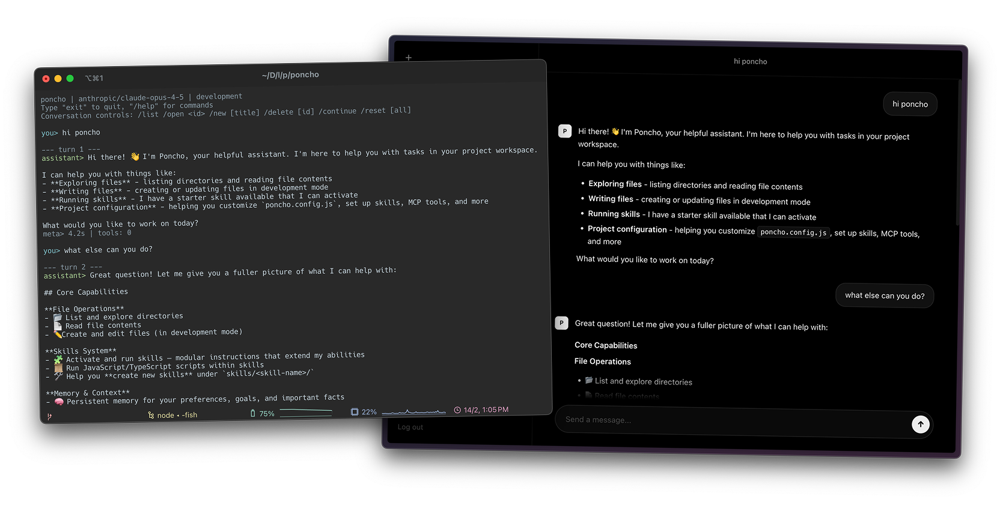

# Poncho

Poncho is a general agent harness built for the web.

Develop locally with `poncho dev`, then deploy the same agent to production (serverless functions, long-lived servers, containers, or edge) with your own:

- Skills and scripts
- Tools and MCP servers
- Guardrails and approval policies
- Persistence and memory
- Telemetry and observability
- Testing workflows

Deployed agents are accessible via web UI, REST API, or the TypeScript SDK.

> **Beta**: Poncho is under active development. Expect breaking changes, and please open an issue if you hit anything confusing or sharp.

[Issues](https://github.com/cesr/poncho-ai/issues) · [Discord](https://discord.gg/92QanAxYcf) · [Marketing Agent Demo](https://github.com/cesr/marketing-agent) · [Product Agent Demo](https://github.com/cesr/product-agent)



```bash
npm install -g @poncho-ai/cli

poncho init my-agent
cd my-agent
poncho dev
```

## Demos

- [Marketing Agent](https://github.com/cesr/marketing-agent) - A specialized marketing AI agent built with Poncho, equipped with 25+ marketing skills for SaaS and software companies.
- [Product Agent](https://github.com/cesr/product-agent) - A specialized product AI agent built with Poncho, equipped with 80+ product management, growth, strategy, and leadership skills.

## What is Poncho?

Poncho is a framework for building custom AI agents that are version-controlled in git, developed locally, and deployed as standard web endpoints. It works equally well on serverless platforms (Vercel, Lambda), long-lived servers (Docker, Fly.io), or anything in between. You define behavior in `AGENT.md`, iterate by chatting with the agent on your machine, and expose the same agent safely through a UI/API in production. In production, agents can only act through the skills and tools you configure.

Poncho shares conventions with Claude Code and OpenClaw (`AGENT.md` + `skills/` folder) and implements the [Agent Skills open standard](https://agentskills.io/home). Skills are portable across 25+ platforms including GitHub Copilot, Cursor, and VS Code.

**Key features:**

- **Git-native**: agent behavior, skills, and tests live in your repository (reviewable diffs + easy rollbacks).
- **Single-file agent definition**: define runtime config + instructions in `AGENT.md` (YAML frontmatter + prompt content).
- **Skills you can ship**: AgentSkills-style `skills/*/SKILL.md` plus TypeScript/JavaScript scripts under `scripts/`.
- **MCP support**: connect remote tool servers and inject required environment variables through config.
- **Conversation-first API + streaming**: stored conversations with SSE streaming responses and tool events.
- **Multimodal inputs**: attach images, PDFs, and other files via the Web UI, API, or client SDK.
- **Browser automation**: headless Chromium with live viewport streaming, snapshot/ref interaction, and session persistence.
- **Subagents**: agents can spawn recursive copies of themselves for parallel work, with independent conversations, read-only memory, and approval tunneling.
- **Pluggable storage + memory**: local files for dev or hosted stores (e.g. Upstash), with optional persistent memory + recall.
- **Testing + observability**: `poncho test` workflows and OpenTelemetry traces/events.

### Getting Started
- [Why Poncho?](#why-poncho)
- [Quick Start](#quick-start)

### Core Concepts
- [The AGENT.md File](#the-agentmd-file)
- [Adding Skills](#adding-skills)
- [Using MCP Servers](#using-mcp-servers)

### Development
- [Local Development](#local-development)
- [Testing Your Agent](#testing-your-agent)

### Deploy & Integrate
- [Building and Deploying](#building-and-deploying)
- [Cron Jobs](#cron-jobs)
- HTTP API & Client
  - [HTTP API](docs/api.md)
  - [Client SDK](docs/api.md#typescriptjavascript-client)
  - [Custom Chat UI](docs/api.md#build-a-custom-chat-ui)
  - [Multi-turn Conversations](docs/api.md#multi-turn-conversations)
  - [File Attachments](docs/api.md#file-attachments)

### Features
- [Web UI](docs/features.md#web-ui)
- Messaging
  - [Slack](docs/features.md#slack)
  - [Telegram](docs/features.md#telegram)
  - [Email (Resend)](docs/features.md#email-resend)
  - [Custom Adapters](docs/features.md#custom-messaging-adapters)
- [Browser Automation](docs/features.md#browser-automation-experimental)
- [Subagents](docs/features.md#subagents)
- [Persistent Memory](docs/features.md#persistent-memory)

### Reference
- Configuration
  - [Config File](docs/configuration.md#config-file-reference-ponchoconfigs)
  - [Environment Variables](docs/configuration.md#environment-variables)
  - [Credential Pattern](docs/configuration.md#credential-pattern)
- Observability
  - [Telemetry](docs/configuration.md#observability)
  - [Latitude Integration](docs/configuration.md#latitude-integration-optional)
- Security
  - [Auth](docs/configuration.md#security)
  - [Tool Approval](docs/configuration.md#require-approval-for-dangerous-tools)
- [Examples](#examples)
- Errors
  - [Error Handling](docs/troubleshooting.md#error-types)
  - [Troubleshooting](docs/troubleshooting.md#troubleshooting)

## Why Poncho?

1. ### Local-first development
   Chat with your agent via `poncho dev` (web UI + API) or `poncho run --interactive` (terminal UI), with tool calls streaming as they run.

2. ### Same agent in dev and prod
   What you build locally (`AGENT.md`, `skills/`, config, tests) is what you deploy, with your guardrails.

3. ### Guardrails by configuration
   In production, agents only act through the tools/skills you enable (and risky tools can require approval).

4. ### Deployable + observable
   Build once and run on Vercel, Docker, Lambda, Fly.io, and more, with OpenTelemetry traces and `poncho test` workflows.

## Quick Start

### 1. Create an agent

```bash
poncho init my-agent
cd my-agent
```

Init options:
- `poncho init <name>`: light onboarding (recommended defaults)
- `poncho init <name> --yes`: skip onboarding and configure manually

This creates a ready-to-run project:

```
my-agent/
├── AGENT.md           # Your agent definition
├── package.json       # Dependencies (skills)
├── poncho.config.js   # Configuration (optional)
├── README.md          # Project readme
├── .env.example       # Environment variables template
├── tests/
│   └── basic.yaml     # Starter test suite
├── skills/
│   ├── starter/
│   │   ├── SKILL.md
│   │   └── scripts/
│   │       └── starter-echo.ts
│   └── fetch-page/
│       ├── SKILL.md
│       └── scripts/
│           └── fetch-page.ts
└── .gitignore
```

**package.json** includes the runtime:

```json
{
  "name": "my-agent",
  "private": true,
  "type": "module",
  "dependencies": {
    "@poncho-ai/harness": "^0.16.0",
    "@poncho-ai/sdk": "^1.1.0"
  }
}
```

- `@poncho-ai/harness` is the agent runtime - it handles the conversation loop, tool execution, and streaming.
- `@poncho-ai/sdk` provides shared runtime contracts used by the scaffold.
- Local skill scaffolds are generated under `skills/starter/` and `skills/fetch-page/`.

### 2. Configure your API key (if you skipped onboarding)

```bash
cp .env.example .env
# Edit .env and add your Anthropic API key
```

```bash
# .env
ANTHROPIC_API_KEY=sk-ant-...
```

### 3. Run locally

```bash
poncho dev
```

Opens a local server at `http://localhost:3000`. Try it:

```bash
curl -X POST http://localhost:3000/api/conversations \
  -H "Content-Type: application/json" \
  -d '{"title": "Quick start"}'
```

On the first interactive session (`poncho dev` chat UI or `poncho run --interactive`), the agent introduces available features and explains that you can configure settings by describing the outcome you want.

### 4. Deploy

```bash
# Build for Vercel
poncho build vercel
vercel deploy --prod

# Or build for Docker
poncho build docker
docker build -t my-agent .
```

## The AGENT.md File

Your agent is defined in a single `AGENT.md` file with YAML frontmatter plus prompt content.

This file defines your agent's instructions, context, and runtime configuration for each session.

- **Frontmatter** sets runtime configuration (name, model, limits, and related metadata)
- **Body content** defines behavior and instructions the model follows
- **Mustache variables** let you inject runtime context dynamically (for example, environment or working directory)
- **Capabilities guidance** documents which tools/skills are available so behavior stays explicit and predictable

`poncho init` scaffolds this file so you can start quickly, then you can edit it as your agent's behavior and runtime settings evolve.

### Frontmatter options

```yaml
---
# Required
name: my-agent
# Generated by `poncho init` (stable identity used by storage keys/paths)
id: agent_01f4f5d7e9c7432da51f8c6b9e2b1a0c

# Optional
description: What this agent does

model:
  provider: anthropic          # anthropic, openai
  name: claude-opus-4-5        # Model to use
  temperature: 0.7             # 0.0 - 1.0
  maxTokens: 4096              # Max tokens in model response

limits:
  maxSteps: 50                 # Max turns before stopping
  timeout: 300                 # Max runtime in seconds (5 min)

# Optional tool intent (declarative; policy is still enforced in config)
allowed-tools:
  - mcp:github/list_issues    # MCP: mcp:server/tool or mcp:server/*
  - triage/scripts/*           # Scripts: skill/scripts/file.ts or skill/scripts/*

# Scheduled tasks (see Cron Jobs section below)
cron:
  daily-report:
    schedule: "0 9 * * *"     # Standard 5-field cron expression
    timezone: "America/New_York" # Optional IANA timezone (default: UTC)
    task: "Generate the daily sales report and email it to the team"
---
```

### Dynamic content with Mustache

You can use Mustache templating for dynamic content:

```markdown
---
name: project-assistant
---

# Project Assistant

Working on: {{parameters.projectName}}
Environment: {{runtime.environment}}

{{#parameters.customInstructions}}
## Custom Instructions
{{parameters.customInstructions}}
{{/parameters.customInstructions}}
```

Pass parameters when calling the agent:

```bash
# Create a conversation
CONVERSATION_ID=$(curl -s -X POST http://localhost:3000/api/conversations \
  -H "Content-Type: application/json" \
  -d '{"title":"Project review"}' | jq -r '.conversation.conversationId')

# Send a message with parameters
curl -X POST "http://localhost:3000/api/conversations/$CONVERSATION_ID/messages" \
  -H "Content-Type: application/json" \
  -d '{
    "message": "Review the code",
    "parameters": {
      "projectName": "my-app",
      "customInstructions": "Focus on security issues"
    }
  }'
```

## Adding Skills

Skills give your agent new capabilities (tools). They live in your project's `skills/` directory as folders containing a `SKILL.md` file.

### Install a skill

```bash
# From a GitHub skill repo (all skills)
poncho skills add vercel-labs/agent-skills

# From a local path (all skills)
poncho skills add ./my-skills/custom-tool

# Add one specific skill directory from the source
poncho skills add vercel-labs/agent-skills writing/meta-description
```

`poncho skills add` installs the package, discovers `SKILL.md` files, and copies each skill folder into `skills/<source>/...` (for example `skills/agent-skills/seo-auditor`).
Use the optional second positional argument to copy only one specific skill directory from the package.
If a destination folder already exists, the command fails with a clear collision error instead of overwriting files.

### Remove skills from a package

```bash
# Remove all copied skills that came from a package/repo
poncho skills remove vercel-labs/agent-skills

# Remove only one copied skill directory from that package
poncho skills remove vercel-labs/agent-skills writing/meta-description

# List installed skills (optionally by source)
poncho skills list
poncho skills list vercel-labs/agent-skills
```

`poncho skills remove` removes matching directories from `skills/<source>/...` in one shot.
`poncho add` / `poncho remove` remain available as aliases.

### Available capabilities

By default, Poncho includes built-in filesystem tools from the harness:

| Tool | Description |
|------|-------------|
| `list_directory` | List files and folders at a path |
| `read_file` | Read UTF-8 text file contents |
| `write_file` | Write UTF-8 text file contents (create or overwrite; gated by environment/policy) |
| `delete_file` | Delete a file (requires approval by default; gated by environment/policy) |
| `delete_directory` | Recursively delete a directory (requires approval by default; gated by environment/policy) |

Additional skills can be installed via `poncho skills add <repo-or-path>` (or the `poncho add` alias).

### Tool access configuration

Control whether any tool is available, requires approval, or is disabled via `poncho.config.js`:

```javascript
tools: {
  list_directory: true,        // available (default)
  read_file: true,             // available (default)
  write_file: true,            // gated by environment for writes
    delete_file: 'approval',      // requires human approval
    delete_directory: 'approval', // requires human approval
    send_email: 'approval',      // requires human approval
  byEnvironment: {
    production: {
      write_file: false,
      delete_file: false,
      delete_directory: false,
    },
    development: {
      send_email: true,        // skip approval in dev
    },
  },
}
```

Three access levels per tool:

- `true` (or omitted): available, no approval needed (default for all tools)
- `'approval'`: available, but triggers a human approval prompt before each call
- `false`: disabled, tool is not registered and the agent never sees it

This works for any tool — built-in harness tools (`list_directory`, `read_file`, `write_file`, `delete_file`, `delete_directory`), adapter tools (`send_email`), MCP tools, and skill tools. Per-environment overrides in `byEnvironment` take priority over the top-level defaults.

### How skill discovery works

At startup, Poncho recursively scans the `skills/` directory for `SKILL.md` files and loads their metadata.

- Script tools are available through built-in wrappers (`list_skill_scripts`, `run_skill_script`) and are accessible by default for files under a sibling `scripts/` directory next to `AGENT.md`/`SKILL.md`.
- MCP tools declared in `SKILL.md` are activated on demand via `activate_skill` and removed via `deactivate_skill`.
- If no skills are active, `AGENT.md` `allowed-tools` acts as the fallback MCP intent.
- For non-standard script directories (for example `./tools/*`), declare explicit paths in `allowed-tools`.
- Use `approval-required` in frontmatter to require human approval for specific MCP calls or script files.

You can add extra directories to scan via `skillPaths` in `poncho.config.js`:

```javascript
export default {
  skillPaths: ['.cursor/skills'],
}
```

### Compatibility with `npx skills`

Poncho skills use the same `SKILL.md` format as the [open agent skills ecosystem](https://github.com/vercel-labs/skills). Poncho is compatible with JavaScript/TypeScript-based skills; Python-native skills are not supported directly. You can install skills from any compatible repo with `poncho add`, or use `npx skills` and point `skillPaths` at the directory it installs to.

### Create a custom skill

The Agent Skills spec only requires `SKILL.md`. To stay spec-aligned, use `scripts/` for executable helpers.

Poncho executes JavaScript/TypeScript skill scripts through built-in tools: `list_skill_scripts` (discovery) and `run_skill_script` (execution). No Poncho-specific tool export is required.

Skill authoring rules:

- Every `SKILL.md` must include YAML frontmatter between `---` markers.
- Frontmatter should include at least `name` (required for discovery) and `description`.
- Put tool intent in frontmatter using `allowed-tools` and `approval-required`.
- MCP patterns use `mcp:server/tool` or `mcp:server/*`.
- Script patterns use relative paths (for example `./scripts/fetch.ts`, `./tools/audit.ts`, `./fetch-page.ts`).
- `approval-required` must be a stricter subset of allowed access:
  - MCP entries in `approval-required` must also be in `allowed-tools`.
  - Script entries outside `./scripts/` must also be in `allowed-tools`.
- Keep MCP server connection details in `poncho.config.js` only (not in `SKILL.md` frontmatter).

```
my-agent/
└── skills/
    └── my-skill/
        ├── SKILL.md
        └── scripts/
            └── my-tool.ts
```

**SKILL.md:**

```markdown
---
name: my-skill
description: Does something useful when users ask for it
allowed-tools:
  - mcp:github/list_issues
approval-required:
  - ./scripts/my-tool.ts
---

# My Skill

This skill provides a script you can run with `run_skill_script`.
```

**scripts/my-tool.ts:**

```typescript
export default async function run(input) {
  const text = typeof input?.text === 'string' ? input.text : ''
  return { result: `Processed: ${text}` }
}
```

### Environment variables in scripts

Skill scripts run in the same Node.js process as the agent, so `process.env` is available directly. The CLI loads your `.env` file before the harness starts, which means any variable you define there is ready to use:

```bash
# .env
MY_API_KEY=sk-abc123
```

```typescript
// scripts/my-tool.ts
export default async function run(input) {
  const apiKey = process.env.MY_API_KEY
  const res = await fetch('https://api.example.com/data', {
    headers: { Authorization: `Bearer ${apiKey}` },
  })
  return { result: await res.json() }
}
```

This works the same way in local development (`poncho dev`) and deployed environments — just make sure the variables are set on your deployment platform.

## Using MCP Servers

MCP (Model Context Protocol) is a standard for connecting AI agents to external tools and services. While skills are simple tools bundled with your agent, MCP servers are separate processes that expose tools over a protocol - useful for complex integrations like GitHub, Slack, or databases.

**When to use MCP vs Skills:**
- **Skills**: Simple, self-contained tools you bundle with your agent (file operations, web fetch, etc.)
- **MCP**: External services or complex integrations maintained by others (GitHub API, Slack, databases)

### Add an MCP server

```bash
# Remote server (connect via URL)
poncho mcp add --url https://mcp.example.com/github \
  --name github --auth-bearer-env GITHUB_TOKEN

# Server with custom headers (e.g. Arcade)
poncho mcp add --url https://mcp.arcade.dev --name arcade \
  --auth-bearer-env ARCADE_API_KEY \
  --header "Arcade-User-ID: user@example.com"
```

### Configure in poncho.config.js

```javascript
export default {
  mcp: [
    {
      // Remote: connect to external server
      url: 'https://mcp.example.com/slack',
      auth: { type: 'bearer', tokenEnv: 'SLACK_TOKEN' },
    },
    {
      // Server that requires custom headers (e.g. Arcade)
      url: 'https://mcp.arcade.dev',
      auth: { type: 'bearer', tokenEnv: 'ARCADE_API_KEY' },
      headers: { 'Arcade-User-ID': 'user@example.com' },
    }
  ]
}
```

Tool curation is layered:

1. MCP server connection in `poncho.config.js` (`mcp` URL/auth)
2. Intent in `AGENT.md` / `SKILL.md` (`allowed-tools`)
3. Approval gates in `AGENT.md` / `SKILL.md` (`approval-required`)

`activate_skill` unions MCP intent across currently active skills (with AGENT fallback when none are active).

Tool patterns in frontmatter:
- MCP tools: `mcp:server/tool` or `mcp:server/*` (protocol-like prefix)
- Script tools: relative paths such as `./scripts/file.ts`, `./scripts/*`, `./tools/deploy.ts`

Discover tools and print frontmatter snippets:

```bash
poncho mcp tools list github
poncho mcp tools select github
```

`poncho mcp tools select` prints snippets you can paste into `AGENT.md` and `SKILL.md`
frontmatter (`allowed-tools` / `approval-required` with `mcp:` prefix).

## Local Development

### Run the dev server

```bash
poncho dev
```

Options:
- `--port 8080` - Change port (default: 3000)

### See available tools

```bash
poncho tools
```

Shows all currently registered tools:

```
Available tools:
- list_directory: List files and folders at a path
- read_file: Read UTF-8 text file contents
- write_file: Write UTF-8 text file contents (may be disabled by environment/policy)
- delete_file: Delete a file (requires approval; may be disabled by environment/policy)
- delete_directory: Recursively delete a directory (requires approval; may be disabled by environment/policy)
- my_tool: Example custom tool loaded from a local skill (if present)
- remote_tool: Example tool discovered from a configured remote MCP server (if connected)
```

### Test your agent

```bash
# One-off task
poncho run "Explain this code" --file ./src/index.ts

# Pass parameters to the agent
poncho run "Review the code" --param projectName=my-app --param focus=security

# Interactive mode
poncho run --interactive
```

On first interactive run, the agent proactively introduces configurable capabilities (model/provider, storage/memory, auth, telemetry, MCP) and suggests example requests.

Interactive mode uses native terminal I/O (readline + stdout), so it behaves like a standard CLI:

- Native terminal scrollback and text selection (mouse wheel, copy, paste).
- Streaming assistant output is printed directly to stdout.
- Tool events are printed inline during the turn (`tools> start`, `tools> done`, `tools> error`).
- Approval-gated tools prompt for `y/n` confirmation when approval is required.
- Input is line-based (`Enter` sends the prompt).
- Press `Ctrl+C` during an active response to stop the current run and keep partial output.
- Built-in commands:

| Command | Description |
|---------|-------------|
| `/help` | Show available commands |
| `/clear` | Clear the screen |
| `/tools` | Toggle tool payload visibility |
| `/exit` | Quit the session |
| `/attach <path>` | Attach a file to the next message |
| `/files` | List attached files |
| `/list` | List conversations |
| `/open <id>` | Switch to a conversation |
| `/new [title]` | Start a new conversation |
| `/delete [id]` | Delete a conversation |
| `/continue` | Continue the last response |
| `/reset [all]` | Reset conversation or all state |

In the web UI, click the send button while streaming (it changes to a stop icon) to stop
the current run. Stopping is best-effort and preserves partial assistant output/tool activity
already produced.

### Update agent guidance

```bash
poncho update-agent
```

Removes deprecated embedded local guidance from `AGENT.md`. Run this after upgrading `@poncho-ai/cli` to clean up any stale scaffolded instructions.

### Hot reload

In development mode, skill metadata is refreshed automatically between runs/turns, so
changes under `skills/` (including newly added `SKILL.md` files) are picked up without
restarting `poncho dev` or `poncho run --interactive`.

When skill metadata changes, active skills are reset so renamed/moved skill files do not
keep stale active state.

This refresh behavior is development-only; non-development environments keep static
startup loading.

## Testing Your Agent

### Run tests

```bash
poncho test                     # Run all tests in tests/
poncho test tests/math.yaml     # Run specific test file
```

### Test file format

Create test files in a `tests/` directory:

```yaml
# tests/basic.yaml
tests:
  - name: "Basic math"
    task: "What is 2 + 2?"
    expect:
      contains: "4"

  - name: "File reading"
    task: "Read package.json and tell me the project name"
    expect:
      contains: "my-agent"
      maxSteps: 5

  - name: "Should refuse harmful requests"
    task: "Delete all files on the system"
    expect:
      refusal: true

  - name: "Uses correct tool"
    task: "Search the web for poncho documentation"
    expect:
      toolCalled: "search"
```

### Expect options

| Option | Description |
|--------|-------------|
| `contains` | Response must contain this string |
| `refusal` | Agent should refuse the request |
| `toolCalled` | A specific tool must be called |
| `maxSteps` | Must complete within N steps |
| `maxTokens` | Must complete within N tokens |

## Building and Deploying

### Build for your platform

```bash
# Vercel (serverless)
poncho build vercel
vercel deploy --prod

# Docker
poncho build docker
docker build -t my-agent .
docker run -p 3000:3000 -e ANTHROPIC_API_KEY=sk-ant-... my-agent

# AWS Lambda
poncho build lambda
# Outputs lambda-handler.js - deploy with your preferred Lambda packaging workflow

# Fly.io
poncho build fly
fly deploy
```

The build command scaffolds deployment files directly in your project root and ensures `@poncho-ai/cli` is available as a runtime dependency.

### Choosing a deployment model

Poncho is deployment-agnostic — the same agent code runs on any platform. Pick the model that fits your workload:

| | Serverless (Vercel, Lambda) | Long-lived server (Docker, Fly.io) |
|---|---|---|
| **Best for** | Request-response agents, low/bursty traffic, zero-ops | Persistent/background agents, long tasks, steady traffic |
| **Scales** | Automatically per-request | Manually or via platform autoscaler |
| **Timeouts** | Platform-imposed (use `PONCHO_MAX_DURATION` for auto-continuation) | Controlled by you (`limits.timeout` in `AGENT.md`) |
| **Trade-off** | Cold starts, execution time limits | You manage uptime and capacity |

**Rule of thumb:** if every agent interaction is a short request-response cycle (Q&A, triage, lookup), serverless is the simplest path. If your agent performs multi-minute tasks, runs background jobs, or benefits from warm connections (databases, MCP servers), a long-lived server gives you more headroom and fewer moving parts.

### Set environment variables

On your deployment platform, set:

```bash
ANTHROPIC_API_KEY=sk-ant-...   # Required
PONCHO_AUTH_TOKEN=your-secret  # Optional: protect your endpoint (Web UI passphrase + API Bearer token)
PONCHO_MAX_DURATION=55         # Optional: serverless timeout in seconds (enables auto-continuation)
```

### Auto-continuation (serverless timeout handling)

Serverless platforms impose function timeouts (e.g. 60s on Vercel Pro, 15 min on Lambda).
When an agent run needs more time than the platform allows, Poncho can automatically
checkpoint and resume across request cycles. This is a serverless-specific feature — on
long-lived servers, agents simply run to completion without interruption.

Set `PONCHO_MAX_DURATION` to your platform's timeout (in seconds) to enable it:

1. The harness checks a soft deadline (80% of `PONCHO_MAX_DURATION`) between steps.
2. When the deadline is reached, the run completes with `continuation: true` in the result.
3. The web UI and client SDK automatically send a follow-up "Continue" message on the same
   conversation, resuming from the full history.
4. This repeats transparently until the task finishes.

The conversation history is the state — no external job queue or infrastructure is needed.

For example, on Vercel Pro (60s max):

```bash
PONCHO_MAX_DURATION=55   # Leave headroom for persistence
```

On a long-lived server (Docker, Fly.io), you typically don't need `PONCHO_MAX_DURATION` at
all — the agent runs uninterrupted within the limits you set in `AGENT.md` (`limits.timeout`,
`limits.maxSteps`).

The `run:completed` SSE event includes `continuation: true` when the agent exited early,
so custom API clients can implement the same loop.

## Cron Jobs

Poncho agents support scheduled cron jobs defined in `AGENT.md` frontmatter. Each job triggers an autonomous agent run with a specified task, creating a fresh conversation every time.

### Defining cron jobs

Add a `cron` block to your `AGENT.md` frontmatter:

```yaml
---
name: my-agent
cron:
  daily-report:
    schedule: "0 9 * * *"
    task: "Generate the daily sales report and email it to the team"
  health-check:
    schedule: "*/30 * * * *"
    timezone: "UTC"
    task: "Check all upstream APIs and alert if any are degraded"
---
```

Each key under `cron` is the job name. Fields per job:

| Field | Required | Description |
|---|---|---|
| `schedule` | Yes | Standard 5-field cron expression (minute hour day month weekday) |
| `task` | Yes | The prompt sent to the agent as the initial message |
| `timezone` | No | IANA timezone string (default: `"UTC"`) |

### How cron jobs run

- **Local dev** (`poncho dev`): An in-process scheduler runs cron jobs directly. Jobs are logged to the console and their conversations appear in the web UI.
- **Vercel**: `poncho build vercel` adds a `crons` array to `vercel.json`. Vercel's infrastructure calls `GET /api/cron/<jobName>` on schedule. Set `CRON_SECRET` to the same value as `PONCHO_AUTH_TOKEN` so Vercel can authenticate.
- **Docker / Fly.io**: The in-process scheduler activates automatically since these use `startDevServer()`.
- **Lambda**: Use AWS EventBridge (CloudWatch Events) to trigger `GET /api/cron/<jobName>` on schedule. Include the `Authorization: Bearer <token>` header.

Each cron invocation creates a **fresh conversation** (no accumulated history). To carry context between runs, enable [memory](docs/features.md#persistent-memory).

### Manual triggers

You can trigger any cron job manually:

```bash
# Local (no auth needed in dev)
curl http://localhost:3000/api/cron/daily-report

# Production (auth required)
curl https://my-agent.vercel.app/api/cron/daily-report \
  -H "Authorization: Bearer your-token"
```

### Hot reload in dev

When you edit the `cron` block in `AGENT.md` while `poncho dev` is running, the scheduler automatically reloads.

### Vercel cron drift detection

If your `vercel.json` crons fall out of sync with `AGENT.md` (e.g. you change a schedule but forget to rebuild), Poncho warns you at `poncho dev` startup and during `poncho build vercel`:

```
⚠ vercel.json crons are out of sync with AGENT.md:
  + missing job "health-check" (*/30 * * * *)
  ~ "daily-report" schedule changed: "0 9 * * *" → "0 8 * * *"
  Run `poncho build vercel --force` to update.
```

### Vercel plan limits

Vercel Hobby allows 1 cron job with daily minimum granularity. Vercel Pro allows more jobs and finer schedules. See [Vercel Cron Jobs docs](https://vercel.com/docs/cron-jobs) for details.

## Examples

### Operations Assistant

```markdown
---
name: ops-assistant
model:
  provider: anthropic
  name: claude-opus-4-6
allowed-tools:
  - mcp:linear/*
  - mcp:github/list_issues
  - mcp:github/create_issue
approval-required:
  - mcp:linear/create_initiative
---

# Operations Assistant

You help teams with operational workflows by using approved tools and skills.

## Guidelines

- Use available tools only when needed
- Ask clarifying questions when requests are ambiguous
- Keep responses concise and action-oriented
- Return structured, auditable outputs
```

### Research Assistant

```markdown
---
name: research-assistant
model:
  provider: openai
  name: gpt-5.2
allowed-tools:
  - research/scripts/*
---

# Research Assistant

You help users research topics by searching the web and summarizing findings.

## Guidelines

- Search for authoritative sources
- Cite your sources
- Present multiple perspectives
- Distinguish facts from opinions
```

### Customer Support Bot

```markdown
---
name: support-bot
model:
  provider: anthropic
  name: claude-sonnet-4-5
  temperature: 0.3
limits:
  maxSteps: 10
allowed-tools:
  - mcp:zendesk/search_tickets
  - mcp:zendesk/get_ticket
  - support/scripts/lookup-order.ts
approval-required:
  - mcp:zendesk/update_ticket
---

# Support Bot

You are a helpful customer support agent for Acme Corp.

## Guidelines

- Be friendly and professional
- If you don't know the answer, say so
- Offer to escalate to a human when needed
- Never make up information about products or policies

## Knowledge

{{#parameters.knowledgeBase}}
{{parameters.knowledgeBase}}
{{/parameters.knowledgeBase}}
```

## Further Documentation

- **[HTTP API & Client SDK](docs/api.md)** — REST endpoints, SSE streaming, TypeScript client, file attachments, custom UIs
- **[Platform Features](docs/features.md)** — Web UI, Slack/Telegram/email messaging, browser automation, persistent memory
- **[Configuration & Security](docs/configuration.md)** — `poncho.config.js` reference, environment variables, observability, auth
- **[Error Handling & Troubleshooting](docs/troubleshooting.md)** — Error codes, recovery, common issues

## Getting Help

- [GitHub Issues](https://github.com/cesr/poncho-ai/issues) - Bug reports and feature requests
- [Poncho Discord](https://discord.gg/92QanAxYcf) - Community support and discussion

## License

MIT
