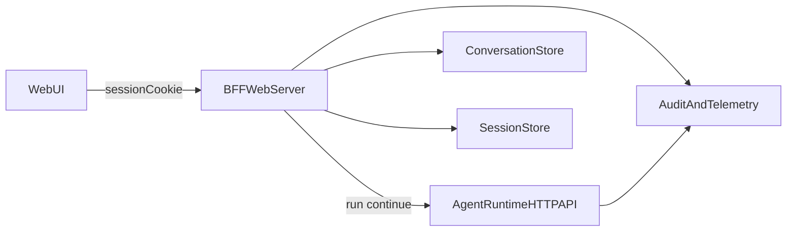

# Poncho Web UI Specification

> ChatGPT-like web interface for local development and deployed agents

**Version**: 0.1.0-draft  
**Status**: RFC  
**Last Updated**: 2026-02-12

---

## Table of Contents

1. [Executive Summary](#1-executive-summary)
2. [Goals and Non-Goals](#2-goals-and-non-goals)
3. [UX Requirements](#3-ux-requirements)
4. [System Architecture](#4-system-architecture)
5. [API and Runtime Integration](#5-api-and-runtime-integration)
6. [Conversation and Session Data Model](#6-conversation-and-session-data-model)
7. [Authentication and Access Security](#7-authentication-and-access-security)
8. [Local and Deployed Operation Modes](#8-local-and-deployed-operation-modes)
9. [Non-Functional Requirements](#9-non-functional-requirements)
10. [Phased Rollout and Acceptance Criteria](#10-phased-rollout-and-acceptance-criteria)
11. [Out of Scope for v1](#11-out-of-scope-for-v1)
12. [Open Questions](#12-open-questions)

---

## 1. Executive Summary

Poncho will add a first-party Web UI that feels familiar to ChatGPT users:

- Left sidebar with past conversations
- Main chat window with streaming responses
- Conversation controls (`new`, `rename`, `delete`, `continue`)

The Web UI must work in both:

- Local development mode
- Deployed production environments

The default v1 security model is **hardened passphrase login + secure server session cookie**, chosen for simplicity and strong baseline security for single-user deployments.

The architecture is intentionally **tenant-ready** (with `tenantId` and `ownerId` model hooks) without forcing multi-user complexity in v1.

---

## 2. Goals and Non-Goals

### 2.1 Goals

| Priority | Goal |
|----------|------|
| P0 | ChatGPT-like UX with sidebar and chat canvas |
| P0 | Smooth streaming chat behavior using existing Poncho runtime endpoints |
| P0 | Secure, simple login for local and deployed usage |
| P0 | Persist and manage conversation history |
| P1 | Clear migration path to multi-user/tenant model |
| P1 | Cross-platform deploy compatibility (Vercel, Docker, Lambda/Fly patterns) |
| P1 | Strong auditing hooks for auth/session/chat events |

### 2.2 Non-Goals (v1)

- Full enterprise IAM suite (SAML/SCIM/RBAC admin console)
- Public social login (Google/GitHub OAuth) by default
- Team sharing permissions model
- Branching/forking conversation trees
- Plugin marketplace UI

---

## 3. UX Requirements

### 3.1 Product UX baseline

The experience should be similar to modern ChatGPT-style apps:

- **Sidebar**
  - List recent conversations ordered by last activity
  - Create new conversation
  - Rename/delete conversation
  - Basic search/filter by title/content snippet (Phase 2)
- **Main chat pane**
  - Message transcript (user/assistant)
  - Streaming assistant responses
  - Retry/regenerate latest response
  - Input composer with submit/cancel during stream
- **Global states**
  - Loading/skeleton behavior
  - Empty state for first conversation
  - Error state with retry options
  - Connection status indicator

### 3.2 Open-source reference implementations

Reference these projects for UX and interaction patterns:

- **LibreChat** (`https://github.com/danny-avila/LibreChat`)  
  Mature chat UX and security posture references for future multi-user expansion.
- **Chatbot UI** (`https://github.com/mckaywrigley/chatbot-ui`)  
  Lean chat-first layout and interaction flow references.

These are references only. Poncho retains its own architecture and API contracts.

### 3.3 Primary user journeys

1. **First-time login**
   - User opens Web UI
   - User enters passphrase
   - Server sets secure session cookie
   - User lands in empty/new chat view
2. **Start new conversation**
   - User clicks new chat
   - User submits first prompt
   - Assistant streams response from runtime
3. **Continue prior conversation**
   - User selects conversation in sidebar
   - User sends follow-up message
   - UI calls continuation endpoint and streams new output
4. **Manage history**
   - User renames or deletes conversations
   - Sidebar updates immediately

---

## 4. System Architecture

Web UI is a browser client served by a web server/BFF layer that:

- Owns browser auth/session management
- Proxies/coordinates calls to Poncho runtime endpoints
- Persists conversation and session metadata

---

## 5. API and Runtime Integration

### 5.1 Runtime endpoints consumed

- `POST /api/conversations/:conversationId/messages` (SSE streaming)
- `GET /health` (readiness)

### 5.2 Interaction model

- New conversation:
  - UI invokes `POST /api/conversations`
  - Server stores conversation + first message metadata
- Continued conversation:
  - UI invokes server route mapped to `POST /api/conversations/:conversationId/messages`
  - Server appends messages and updates `updatedAt`
- Streaming:
  - Preserve low-latency token/chunk rendering in UI
  - Surface tool/step/error events in a user-friendly way

### 5.3 Backward compatibility

- Web and terminal surfaces now use the same conversation-centric API model
- Existing direct clients should migrate from `/run`/`/continue` to `/api/conversations/*`
- Web UI auth is additive and browser-specific

---

## 6. Conversation and Session Data Model

### 6.1 Conversation entities (v1 tenant-ready)

Minimum fields:

- `conversationId`
- `title`
- `messages` (or normalized message rows)
- `runtimeRunId` (for continuation linking)
- `ownerId` (single-user default owner)
- `tenantId` (nullable in v1, required in future multi-tenant mode)
- `createdAt`, `updatedAt`

### 6.2 Session entities

- `sessionId`
- `ownerId`
- `createdAt`, `expiresAt`, `lastSeenAt`
- `ipHash` / `userAgentHash` (optional defense-in-depth)

### 6.3 Storage abstraction

Define storage via interface to support:

- Local dev defaults (simple file/sqlite/in-memory adapter)
- Production adapters (Redis + durable DB, Postgres, or managed KV + DB split)

---

## 7. Authentication and Access Security

### 7.1 Chosen default for v1

**Hardened passphrase login + secure cookie sessions**

Configuration:

- `AGENT_UI_PASSPHRASE` (required in deployed mode)

Behavior:

- Login form accepts passphrase
- Server verifies with constant-time comparison
- On success, server issues secure session cookie

### 7.2 Required hardening controls

1. **Passphrase quality**
   - Recommend random high-entropy secret (not dictionary phrase)
   - Minimum length guidance in docs (for example 24+ chars)
2. **Rate limiting**
   - Per-IP and global throttle on login endpoint
   - Temporary lockout after repeated failures
3. **Session cookie hardening**
   - `HttpOnly`
   - `Secure` (required in deployed mode)
   - `SameSite=Lax` (or stricter where feasible)
   - Short-lived access session + rotation policy
4. **CSRF protection**
   - Token or same-site defense for state-changing requests
5. **Transport security**
   - HTTPS required in deployment
   - Plain HTTP allowed only for local loopback development

### 7.3 Relationship to existing Poncho API auth

- Existing runtime API auth (`Authorization: Bearer`) remains the runtime boundary.
- Web UI session auth protects browser users at the UI/BFF layer.
- Internal UI server-to-runtime calls may use trusted internal networking and/or API key.

### 7.4 Optional hardening profiles

- **Private-network mode**: deploy behind VPN/reverse proxy/IP allowlist.
- **Optional 2FA mode**: TOTP step-up authentication for sensitive environments.

---

## 8. Local and Deployed Operation Modes

### 8.1 Local mode

- Single process or paired local services (UI + runtime)
- Loopback host (for example `localhost`)
- Fast onboarding with one passphrase env var

### 8.2 Deployed mode

- UI and runtime can be:
  - Same origin (preferred simplicity)
  - Separate services behind reverse proxy
- TLS termination at platform/proxy
- Secrets from platform-managed env vars

### 8.3 Deployment compatibility

Design must remain compatible with:

- Vercel
- Docker-based deployments
- Lambda/Fly-style server deployments (where applicable)

---

## 9. Non-Functional Requirements

### 9.1 Performance

- Perceived streaming responsiveness equivalent to existing CLI streaming UX
- First visible token/chunk target documented for baseline environments

### 9.2 Reliability

- Graceful handling of transient stream interruption
- Recoverable error states with retry UX

### 9.3 Accessibility

- Keyboard-first navigation across sidebar and composer
- Focus management for navigation and message send
- Adequate color contrast and screen-reader labels

### 9.4 Auditability and privacy

- Emit structured auth/session/chat events for audit trails
- Support retention policy controls for conversation history
- Avoid logging secrets or raw passphrase input

---

## 10. Phased Rollout and Acceptance Criteria

### Phase 1 (MVP)

Scope:

- Web shell layout (sidebar + chat pane)
- Streaming chat via runtime endpoints
- Conversation CRUD (create/list/open/rename/delete)
- Hardened passphrase auth and secure sessions

Acceptance criteria:

- User can log in, start chat, continue chat, and see history after refresh
- Unauthorized users cannot access conversation data
- Failed login attempts are rate-limited
- SSE chat output renders incrementally

### Phase 2 (Usability + hardening)

Scope:

- Conversation search
- Improved reconnect/retry behavior
- Better empty/error/loading states
- Session management improvements (rotation/expiry UX)

Acceptance criteria:

- Search returns relevant local history quickly
- Stream interruption states recover without page reload
- Session expiry behavior is clear and predictable

### Phase 3 (Multi-tenant path)

Scope:

- Tenant-aware authorization wiring
- Optional enterprise auth adapters
- Settings surface for stricter security profiles

Acceptance criteria:

- Authorization checks enforce owner/tenant isolation boundaries
- Migration path from single-user data model is documented and tested

---

## 11. Out of Scope for v1

- Shared team workspaces and role management
- Org directory sync
- Real-time collaborative editing
- Public conversation share links
- Agent marketplace/discovery inside UI

---

## 12. Open Questions

1. Which storage adapter should be default for local conversation persistence?
2. Should Phase 1 include file upload messages or defer to Phase 2?
3. Should optional TOTP be implemented in Phase 2 or Phase 3?
4. Do we need resumable streams in v1, or can reconnect + retry satisfy initial UX?
